# Düzenli Ödeme ve Abonelik Takip Uygulaması — Ürün ve Teknik Plan

## 1. Ürün temeli

### Problem tanımı

Kullanıcılar sabit veya öngörülebilir düzenli ödemelerini farklı uygulamalar, kartlar ve takvimler arasında takip ediyor. Sonuç olarak:

- Bir sonraki ödeme ve deneme bitiş tarihleri unutuluyor.
- Ödemenin hangi karttan yapıldığı bilinmiyor.
- Farklı para birimlerindeki aylık yükümlülükler görülemiyor.
- Tahmini ödemeler ile gerçekten yapılmış ödemeler karıştırılıyor.
- İptal edilmiş veya kullanılmayan abonelikler görünmez hâle geliyor.
- Abonelik fiyat artışları farklı kaynaklarda duyuruluyor; kullanıcı eski ve yeni fiyatın kendi aylık yüküne etkisini kolayca göremiyor.

Uygulama banka hareketlerini doğrulayan bir finans/muhasebe ürünü değil; kullanıcının beyanıyla çalışan kişisel yükümlülük panelidir.

### Hedef kullanıcılar

İlk Android ürün doğrulamasındaki tek birincil kullanıcı:

- Türkiye’de yaşayan, yaklaşık 20–35 yaş aralığında ve en az 3–5 sabit veya tahmin edilebilir düzenli ödemesi bulunan birey.
- Netflix, Spotify, YouTube Premium, ChatGPT, oyun/yazılım üyeliği, telefon, internet veya spor salonu gibi ödemeleri bulunan kişi.
- Birden fazla banka veya kart kullanan; ödemenin hangi yöntemden çekileceğini ve yaklaşan ödeme/deneme bitişini zaman zaman karıştıran kişi.
- Aylık düzenli ödeme yükünü tek yerde görmek, fiyat değiştiğinde eski ve yeni tutarı karşılaştırmak isteyen kişi.
- Finans veya muhasebe uzmanı olmayan; Excel, not ve takvimle manuel takibi zahmetli bulan, hızlı ve sade deneyim bekleyen kişi.

Sonraki araştırmalardaki ikincil segmentler:

- Serbest çalışanlar ve küçük işletme sahipleri.
- Çok sayıda yazılım lisansı bulunan profesyoneller.
- Yalnızca kredi veya taksit takibi yapan bireyler.

Aile/ortak hesap kullanıcıları ilk doğrulamanın birincil hedefi değildir. Çekirdek MVP, kullanıcının kendi cihazında ortak bir aboneliği ve kendi ödeme payını kaydetmesini engellemez; davet, paylaşım ve senkronizasyon sonraki aşamadadır.

### Mevcut alternatifler

| Alternatif | Güçlü yanı | Açık kalan ihtiyaç |
|---|---|---|
| Notlar ve takvim | Ücretsiz, kolay erişilir | Toplam, kategori, ödeme yöntemi ve durum takibi yok |
| Excel/Google Sheets | Esnek hesaplama | Manuel bakım ve bildirim zayıf |
| Banka uygulamaları | Gerçek işlemleri gösterir | Bankalar arası bütünlük ve gelecek tahmini yok |
| Bütçe uygulamaları | Harcama raporları güçlü | Türkiye desteği, manuel yükümlülük ve deneme takibi değişken |
| Hizmetlerin kendi uygulamaları | Kesin üyelik bilgisi | Tek merkez sunmaz |
| Telefon hatırlatıcıları | Bildirim kolaydır | Finansal özet ve ödeme geçmişi yok |

### Temel değer önerisi

Hesap açmayı zorunlu kılmadan bütün sabit düzenli ödemeleri, ödeme yöntemlerini, yaklaşan tarihleri ve para birimi bazındaki toplamları tek, çevrimdışı çalışan panelde göstermek.

### Tek cümlelik ürün tanımı

> Kullanıcıların aboneliklerini ve sabit düzenli ödemelerini, hangi yöntemle ödendiklerini, yaklaşan tarihlerini ve para birimi bazındaki toplamlarını çevrimdışı olarak tek yerde takip etmelerini sağlayan mobil uygulama.

---

## 2. MVP kapsamı

### Kesin MVP özellikleri

1. Hesap oluşturmadan uygulamayı kullanma.
2. Düzenli ödeme ekleme, görüntüleme, düzenleme, iptal etme, arşivleme.
3. Desteklenen türler:
   - Dijital abonelik
   - Yazılım lisansı
   - Spor salonu/üyelik
   - Aidat
   - Telefon ve internet paketi
   - Sabit kredi/taksit
   - Kullanıcı tanımlı özel ödeme
4. Ad, kategori, tutar, ISO 4217 para birimi, ödeme döngüsü ve sonraki tarih.
5. Ödeme yöntemi için yalnızca kullanıcı tanımlı takma ad.
6. Haftalık, aylık, yıllık ve `n` gün/hafta/ay/yıl periyotları.
7. Opsiyonel deneme bitişi ve düzenli ödeme bitiş tarihi.
8. Durumlar: `active`, `paused`, `cancellationScheduled`, `cancelled`, `completed`, `archived`, `pendingDeletion`.
9. Tahmini ödemelerin ödeme kuralından hesaplanması.
10. İsteğe bağlı “Ödendi” ve “Bu dönem atlandı” işlemleri.
11. Vadesi gelince kalıcılaşan, `awaitingConfirmation`, `paid`, `skipped` ve `voided` yaşam döngüsüne sahip `PaymentOccurrence`.
12. Üç gün önce ve ödeme günü sabahı önerilen yerel bildirimler.
13. Abonelik bazında bildirim günü, saat ve açık/kapalı ayarı.
14. Para birimine göre ayrı aylık/yıllık tahmini toplamlar.
15. Tahmini ve kullanıcı tarafından onaylanmış giderlerin ayrı gösterimi.
16. Kategori, durum, tarih ve ödeme yöntemine göre listeleme/filtreleme.
17. Türkçe arayüz, `tr-TR` biçimlendirme, TRY varsayılanı.
18. İlk günden merkezi yerelleştirme altyapısı.
19. Açık/koyu tema ve temel erişilebilirlik.
20. Tam çevrimdışı çalışma.
21. Sürümlenmiş, şifreli yerel veri dışa aktarma ve geri yükleme.
22. Kullanıcı verisini ve uygulama ayarlarını cihazdan tamamen silme.
23. Geçerlilik tarihli manuel fiyat güncellemesi ve geçmiş occurrence snapshot’larının korunması.
24. Süresiz, tarihli veya ödeme sayılı tek bir `EndCondition`.
25. Küçük yerel sağlayıcı kataloğu, serbest ad girişi, sistem/özel kategoriler ve kategorisiz kullanım.
26. İsteğe bağlı yerel ortak abonelik bilgisi; toplam plan fiyatı ve kullanıcının ödeme sorumluluğunun bağımsız sürümlenmesi.
27. İsteğe bağlı Android sistem uygulama kilidi.

### Sonraki ürün aşamaları

Çekirdek ürün hesap ve internet gerektirmeden tamamlandıktan sonra özellikler sabit tarihlere değil kalite kapılarına göre eklenir:

- Hesap aşaması: e-posta/parola ile kayıt ve giriş, e-posta doğrulama, parola sıfırlama, Google hesabıyla giriş, çıkış, hesap silme ve misafir verisini hesaba bağlama.
- Bulut yedekleme aşaması: kullanıcı onaylı şifreli snapshot yedeği, manuel geri yükleme, son yedekleme zamanı ve bulut verisini silme.
- Android yayın aşaması: yalnız çekirdek ürün, bildirimler, veri güvenliği ve migration testleri kabul kriterlerini geçtiğinde kapalı beta ve Google Play yayını.
- iOS uyarlama aşaması: Android çekirdeği yeniden yazılmadan iOS bildirim, Keychain ve Apple kimlik adapter’larının eklenmesi.
- Çoklu cihaz aşaması: gerçek senkronizasyon, çakışma çözümü ve sürüm geçmişi yalnız doğrulanmış kullanıcı ihtiyacından sonra.

### İlk sürümde kesinlikle yapılmayacaklar

- Banka/açık bankacılık entegrasyonu.
- Kart numarası, CVV, IBAN veya banka şifresi saklama.
- Değişken elektrik, su, doğalgaz ve kredi kartı faturaları.
- Canlı veya manuel döviz kuru dönüşümü.
- Farklı para birimlerini tek yanıltıcı toplamda birleştirme.
- Gerçek zamanlı ve çift yönlü çoklu cihaz senkronizasyonu.
- Çakışma çözüm motoru ve yedek sürüm geçmişi.
- E-posta/PDF/ödeme bildirimi analizi.
- Otomatik abonelik keşfi veya iptali.
- Gerçek ortak hesap davetleri, kullanıcılar arası senkronizasyon ve ortak ödeme tahsilatı.
- Harici kaynaklardan otomatik fiyat toplama, web scraping, sağlayıcı fiyat API’leri ve kullanıcı onayı olmadan zam uygulama.
- Kullanılmayan abonelik önerileri.
- Reklam, ücretli indirme, mağaza içi satın alma.
- Tam İngilizce arayüz veya küresel mağaza yayını.
- Yıllarca geriye dönük ayrıntılı ödeme girişi.
- Akıllı bildirim zamanı, konum, tatil veya yapay zekâ optimizasyonu.

---

## 3. Temel kullanıcı senaryoları ve iş kuralları

### Ana senaryolar

1. Kullanıcı onboarding’i geçer; hesap ekranı görmeden uygulamaya girer.
2. İlk düzenli ödemesini ekler ve önerilen bildirim tercihini onaylar.
3. Dashboard’da yaklaşan ödemeleri ve TRY/USD/EUR toplamlarını ayrı görür.
4. Bir ödeme geldiğinde isterse “Ödendi” olarak işaretler.
5. Ödeme yapılmadıysa “Bu dönem atlandı” seçer veya hiçbir işlem yapmaz.
6. Ödeme yöntemi değiştiğinde yalnızca gelecek dönemleri yeni karta bağlar.
7. Abonelik iptal edildiğinde gelecek tahminler/bildirimler durur; geçmiş kayıtlar korunur.
8. Kullanıcı verisini şifreli dosyaya aktarır veya tamamen siler.
9. Kullanıcı çekirdek özellikleri hesap açmadan kullanmaya devam eder; isterse hesap aşamasında e-posta/parola veya Google hesabıyla hesap oluşturur.
10. Hesap oluşturan kullanıcının mevcut yerel UUID’leri korunur ve verileri güvenli, idempotent bir işlemle `AppUser` hesabına bağlanır.
11. Bulut yedekleme etkinse kullanıcı açık onay verdikten sonra şifreli snapshot oluşturur; hesap açılması tek başına otomatik yükleme başlatmaz.
12. Kullanıcı ücreti güncellediğinde yeni sürüm varsayılan olarak sonraki ödeme tarihinde başlar; gelişmiş alanda farklı `effectiveFrom` seçilebilir ve geçmiş occurrence’lar değişmez.
13. Vadesi geçen dönem otomatik ödenmiş veya atlanmış sayılmaz; `awaitingConfirmation` olarak kalır ve sonraki döngü devam eder.
14. Ortak abonelikte dashboard ve raporlar toplam plan fiyatını değil kullanıcının kendi ödeme sorumluluğunu esas alır.

### Misafirden hesaba geçiş kuralları

- Yerel misafir kimliği uygulamanın ilk açılışında oluşturulur; giriş ekranı çekirdek kullanımı engellemez.
- Dönüşüm başlamadan önce yerel veri tutarlılığı doğrulanır ve benzersiz bir migration işlem kimliği üretilir.
- `AppUser` oluşturulduktan sonra yerel kayıtların mevcut UUID’leri değişmeden sahiplik ilişkisi güncellenir.
- Aynı migration işlem kimliği yeniden çalıştırıldığında duplicate kullanıcı, abonelik veya ödeme kaydı oluşturulmaz.
- Yerel sahiplik aktarımı transaction içinde yapılır; uzak adımlar başarısız olursa geri alınabilir durum kaydı tutulur.
- Hesap oluşturma veya sağlayıcı girişi başarılı olsa bile aktarım tamamlanmadan yerel veriler silinmez.
- Buluta ilk yedekleme ayrıca kullanıcı onayı gerektirir.
- Hesaptan çıkışta “Bu cihazdaki verileri koru” ve “Bu cihazdaki hesap verilerini kaldır” seçenekleri sunulur.
- Bulut verisini silmek ve hesabı tamamen silmek ayrı, açık ve doğrulanmış işlemlerdir.

### Tarih ve periyot kuralları

- Yalnızca gün ifade eden değerler `LocalDate` semantiğiyle saklanır.
- Teknik biçim ISO `YYYY-MM-DD` olabilir; kullanıcıya locale ile gösterilir.
- Olay zaman damgaları UTC `Instant` olarak saklanır.
- Bildirim saati `LocalTime` olarak tutulur ve cihazın güncel saat diliminde uygulanır; ödeme tarihinin kendisi bir saat dilimine bağlanmaz.
- Ayın 29–31’ine bağlı aylık ödemeler, kısa ayda son güne sıkıştırılır; sonraki uygun ayda tercih edilen güne geri döner.
- 29 Şubat başlangıcı yıllık döngüde artık olmayan yılda 28 Şubat’a düşer.
- Saat dilimi değişince gelecekteki bildirimler yeniden hesaplanır.
- Kullanıcı ödeme tarihini değiştirirse geçmiş `PaymentOccurrence` kayıtları değişmez.
- Duraklatılmış kayıtta tahmin ve bildirim üretilmez; devam ettirirken eski ankrajdan hesaplanan tarih önerilir ve kullanıcı onaylamadan yeni tahmin oluşturulmaz.
- `EndCondition.type` yalnız `none`, `date` veya `occurrenceCount` olabilir; tarih ve ödeme sayısı aynı anda etkin değildir.
- Tarih bitişinde vade tarihi bitiş tarihine eşit olan son occurrence oluşturulur; sonrasına tahmin veya bildirim üretilmez.
- Ödeme sayılı planda yalnız `paid` kalan sayıyı azaltır. `awaitingConfirmation` kotada yer ayırır; `skipped` ve `voided` kotayı tüketmez ve sona yeni sanal dönem eklenir.

### Tahmin ve gerçekleşen ödeme ayrımı

- Gelecek ödeme sınırsız sayıda veritabanı kaydı olarak oluşturulmaz.
- Gelecek occurrence’lar düzenli ödeme kuralından anlık hesaplanan sanal değerlerdir.
- Vade günü gelen veya geçen occurrence, o tarihteki tutar ve ödeme yöntemi snapshot’ıyla kalıcı `PaymentOccurrence` hâline gelir.
- Tarihin geçmiş olması ödeme kanıtı değildir.
- Kullanıcı işlem yapmazsa occurrence `awaitingConfirmation` kalır; gerçekleşen toplamda sıfır harcama iddiası gösterilmez.
- Aynı `recurringPaymentId + expectedPaymentDate` için tek aktif kayıt bulunur.
- Yanlış occurrence silinmek yerine varsayılan olarak `voided` yapılır; kullanıcıya geri alma sunulur.
- Dashboard ve raporlar `paid`, `awaitingConfirmation` ve gelecek tahmini ayrı gösterir.

### Silme ve arşivleme

- Ana kaldırma eylemi “Takibi bırak”tır ve kaydı `archived` yapar; hizmetin dış dünyada iptal edildiği varsayılmaz.
- Arşivleme geçmiş raporları korur, gelecek tahmin/bildirimleri kaldırır ve aynı UUID ile geri etkinleştirilebilir.
- Kalıcı silme ayrı, güçlü onaylı işlemdir; varsayılan olarak kayıt `pendingDeletion` olur ve 30 takvim günü geri alınabilir.
- Kullanıcı ayrıca ikinci güçlü onayla hemen geri alınamaz fiziksel silme isteyebilir.
- Kalıcı silme tombstone üretir; eski yedek veya cihaz kaydı sessizce geri getiremez.
- “Bütün verilerimi sil” işlemi geçmiş dâhil yerel verileri kalıcı kaldırır.
- Ödeme yöntemi geçmiş kayıtlarda kullanılıyorsa devre dışı bırakılır; geçmiş kayıt takma ad anlık görüntüsünü korur.
- Hesaptan çıkışta seçenekler: “Bu cihazdaki veriyi koru” veya “Bu cihazdan sil”.
- Buluttaki veri, açık bir “Bulut yedeğini sil” işlemi yapılmadıkça yalnızca cihazdan silme ile kaldırılmaz.

---

## 4. Ekranlar ve navigasyon

### Ana yapı

Dört alt sekme kullanılacak:

1. Ana Panel
2. Ödemeler
3. Raporlar
4. Ayarlar

“Düzenli ödeme ekle” işlemi ana FAB/aksiyon olarak sunulur. Ödemeler sekmesinde “Tümü” ve “Yaklaşan” segmentleri bulunur; ayrı beşinci sekme gerekmez.

### Ekran listesi

#### Çekirdek Android ekranları

- Başlatma/veritabanı hazırlama
- Kısa onboarding
- İlk hatırlatma tercihi
- Ana panel
- Düzenli ödeme listesi
- Yaklaşan ödemeler
- Düzenli ödeme ekleme/düzenleme
- Düzenli ödeme detayı
- Ödeme kaydı onaylama/düzeltme
- Kategori seçimi/yönetimi
- Ödeme yöntemi listesi ve formu
- Raporlar
- Bildirim tercihleri
- Görünüm, locale ve para birimi ayarları
- Veri dışa aktarma/içe aktarma
- Gizlilik ve bütün verileri silme

#### Hesap aşaması ekranları

- Hesap avantajları ve isteğe bağlı hesap oluşturma
- E-posta/parola ile kayıt ve giriş
- E-posta doğrulama ve parola sıfırlama
- Google hesabıyla giriş
- Hesap kimlikleri ve bağlı sağlayıcılar
- Çıkış ve hesap silme

#### Bulut yedekleme aşaması ekranları

- Bulut yedekleme ve geri yükleme
- Son başarılı yedekleme ve bulut verisini silme

#### iOS aşaması ekranları

- Apple ile giriş ve identity-linking
- iOS izin ve bildirim ayarları
- Ortak ekranların iOS erişilebilirlik ve platform uyarlamaları

### Navigasyon ilkeleri

- `go_router` ile merkezi, isimlendirilmiş ve tip güvenli route tanımları.
- Route string’leri ekranlara dağıtılmaz.
- Bildirim payload’ı yalnızca iç kimlik ve route türü taşır; tutar/ad gibi bilgiler loglanmaz.
- Bildirime dokunma ilgili düzenli ödeme detayına gider.
- Route bulunamazsa güvenli biçimde ana panele döner.
- Deep link altyapısı hazırlanır; dış kaynaklı deep link kullanımı hesap/yedekleme gelene kadar açılmaz.
- Auth callback route’ları sağlayıcı SDK’larından gelen sonucu auth feature içindeki use-case’lere aktarır; ekranlar Supabase, Google veya Apple SDK’sını doğrudan çağırmaz.

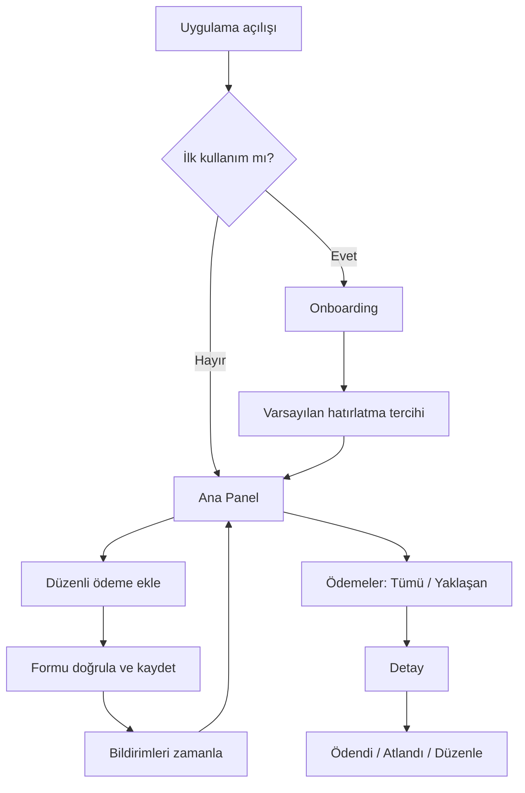

---

## 5. Veri modeli

### Ortak veri kuralları

- Kimlikler cihazda üretilen UUID’dir; buluta geçince değiştirilmez.
- Para `double` ile değil, en küçük para birimindeki tamsayı `amountMinor` ve ISO 4217 koduyla saklanır.
- Silinebilir tablolarda `createdAt`, `updatedAt`, gerekirse `archivedAt/voidedAt` bulunur.
- Yerel veritabanı ana kaynak, bulut ise yalnızca yedek kopyadır.
- Gösterim biçimleri veri modeline yazılmaz.
- Türkiye’ye özgü banka ve sağlayıcılar enum değildir; güncellenebilir katalog veya serbest metindir.
- `AppUser.id` uygulamanın sağlayıcıdan bağımsız UUID kimliğidir; Supabase user ID, Google subject veya Apple subject domain ana kimliği olamaz.
- Giriş bilgisi görünen addan ayrıdır; `displayName` isteğe bağlıdır, benzersiz olmak zorunda değildir ve giriş için kullanılmaz.
- Bir `AppUser` birden fazla `AuthIdentity` ile ilişkilendirilebilir; kimlik bağlama sessiz yapılmaz ve yeniden doğrulama gerektirir.

### Varlıklar

| Varlık | Temel alanlar ve doğrulama | İlişki / varsayılan | Hassasiyet ve saklama |
|---|---|---|---|
| `LocalIdentity` | `installationId: UUID`, `createdAt: Instant` | İlk açılışta üretilir | Yerel; kullanıcı hesabı değildir |
| `AppUser` | `id: UUID`, `displayName?`, `createdAt`, `deletedAt?` | Sağlayıcıdan bağımsız uygulama hesabı | Yerel ve hesap aşamasında uzak metadata; hesap silmede imha |
| `AuthIdentity` | `id`, `appUserId`, `provider`, `providerSubject`, `email?`, `emailVerified`, `createdAt`, `lastSignInAt` | Bir kullanıcıya birden fazla kimlik bağlanabilir; `provider + providerSubject` benzersiz | E-posta kişisel veridir; auth sağlayıcısı ve gerekli yerel session metadata’sında tutulur |
| `AuthSession` | `appUserId`, `activeIdentityId`, `status`, `expiresAt?`, `refreshedAt?` | Guest, authenticated, expired veya signedOut | Token değerleri domain entity’sinde tutulmaz; güvenli session storage kullanılır |
| `RecurringPayment` | `id`, `kind`, `displayName(1..100)`, `providerId?`, `providerNameSnapshot?`, `categoryId?`, `cycle`, `preferredDay?`, `nextPaymentDate`, `endCondition`, `paymentMethodId?`, `status`, `note?`, zaman damgaları | TRY, aktif; tutar ayrı sürümlerden çözülür | Yerel; finansal nitelikli kişisel kayıt; takip bırakılınca arşiv |
| `BillingCycle` | `unit: day/week/month/year`, `interval: 1..365` | Aylık/1 | Domain value object; tablo değildir |
| `SubscriptionCategory` | `id`, `localizationKey?`, `customName?`, `iconKey`, `colorToken`, `isSystem` | Sistem veya kullanıcı kategorisi | Yerel; kullanımda ise silmek yerine pasif |
| `PaymentMethod` | `id`, `nickname(1..60)`, `type?`, `issuerText?`, `isActive`, zaman damgaları | Aktif | Kart numarası/son kullanma/CVV yok; referans varsa arşiv |
| `PaymentOccurrence` | `id`, `recurringPaymentId`, `occurrenceKey`, `expectedAmountMinor`, `actualAmountMinor?`, `currencyCode`, `expectedDate`, `actualPaymentDate?`, `paymentMethodId?`, `paymentMethodLabelSnapshot?`, `status`, `confirmedAt?`, `source`, zaman damgaları | `awaitingConfirmation`; kaynak `manual` | Yerel; `occurrenceKey` benzersiz; düzeltilebilir/void |
| `RecurringPrice` | `id`, `recurringPaymentId`, `amountMinor`, `currencyCode`, `effectiveFrom: LocalDate`, `source` | İlk sürüm `manual`; aralıklar çakışmaz | Geçmiş sürüm silinmez; occurrence snapshot’ı geriye dönük değişmez |
| `PlanPriceVersion` | `id`, `recurringPaymentId`, `amountMinor`, `currencyCode`, `effectiveFrom`, `source` | Ortak abonelik toplam fiyatı; isteğe bağlı | Kişisel gider toplamına girmez |
| `UserObligationVersion` | `id`, `recurringPaymentId`, `amountMinor`, `currencyCode`, `effectiveFrom`, `responsibilityType`, `source` | Kişisel raporların esas tutarı | Toplam plan fiyatından otomatik türetilmez |
| `SharingInfo` | `recurringPaymentId`, `type`, `participantCount?`, `payerLabel?`, `userRole`, `note?` | `personal`, `paysFull`, `paysShare`, `paidByOther`, `unknown` | Kişi takma adları ve notlar analitiğe/loga gitmez |
| `TrialInfo` | `recurringPaymentId`, `trialEndDate`, `conversionType`, `firstPaidPaymentDate?`, `confirmedAt?` | `autoRenew`, `manualStart`, `unknown` | Belirsiz dönüşüm kesin toplama girmez |
| `CancellationInfo` | `recurringPaymentId`, `cancellationRequestedAt`, `serviceEndsOn`, `billingEndType`, `finalChargeDate?` | Erişim ve ücret sonu ayrıdır | Geçmiş occurrence’ları değiştirmez |
| `PausePeriod` | `id`, `recurringPaymentId`, `pausedAt`, `resumedAt?`, `previousNextPaymentDate`, `resumedNextPaymentDate?`, `resumeMode` | Aynı kayıtta tek açık dönem | Geçmiş korunur |
| `DeletionRequest` | `id`, `entityType`, `entityId`, `scope`, `requestedAt`, `undoUntil`, `status` | 30 takvim günü; hemen purge ayrı onay | Minimal tombstone ile uzlaştırılır |
| `Reminder` | `id`, `recurringPaymentId`, `offsetDays>=0`, `localTime`, `enabled` | 3 gün ve 0 gün | Yerel; ödeme silinince silinir |
| `NotificationPreference` | `defaultOffsets`, `defaultTime`, `enabled`, `permissionStateCache` | 3 gün + aynı gün | Yerel; işletim sistemi izni gerçek kaynak |
| `UserSettings` | `localeCode`, `preferredCurrencyCode`, `themeMode`, `timeZoneId`, `analyticsConsent`, onboarding alanları | `tr`, TRY, system theme | Yerel; veri silmede kaldırılır |
| `Currency` | `code`, `fractionDigits`, `symbol metadata` | ISO katalog | Konfigürasyon; kullanıcı kaydı değildir |
| `BackupManifest` | `formatVersion`, `schemaVersion`, `createdAt`, `sourcePlatform`, `checksum`, `recordCounts`, `encryptionVersion`, `kdfParameters` | Export/import ve bulut snapshot metadata’sı | Şifreli paketle taşınır; cihaz anahtarına bağımlı değildir |
| `AppLockSettings` | `enabled`, `lockTimeout`, `hideRecentAppsPreview`, `hideNotificationDetails`, `updatedAt` | Varsayılan kapalı | Biyometri/PIN verisi tutulmaz |

`PaymentOccurrence.source` çekirdek sürümde `manual`; bildirim aksiyonu kendi kalite kriterlerini geçtiğinde `notificationAction`; `imported` ve `bankingIntegration` ilgili entegrasyon aşamalarında kullanılır.

Premium/IAP için gelecekte `plan`, `featureFlags`, `validUntil?` ve `source` alanlarını taşıyabilecek bir entitlement entegrasyon noktası değerlendirilir. Ürün doğrulama döneminde entitlement tablosu, domain tipi, servis veya strateji oluşturulmaz.

### ER görünümü

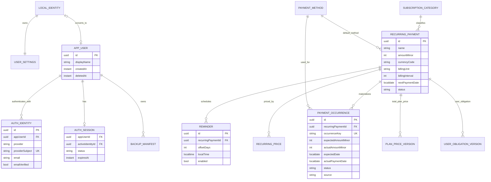

---

## 6. Bildirim sistemi

### Mimari

```text
NotificationPolicy
- buildSchedule(recurringPayment, reminders, timeZone)
- validatePreference(...)
- prioritizePendingRequests(...)

NotificationScheduler
- schedule(request)
- cancelByRecurringPayment(id)
- reconcile(desiredRequests)
- requestPermission()
- getPermissionStatus()
```

İlk gerçek implementasyon `AndroidNotificationScheduler` ile cihazın yerel bildirim sistemini kullanır. Push notification ve internet gerekmez. `IOSNotificationAdapter` yalnız iOS uyarlama aşamasında aynı sözleşmenin implementasyonu olarak eklenir; feature ve domain kodu değişmez.

### İşleyiş

- Kullanıcı ilk düzenli ödemesini eklerken varsayılan tercih sorulur.
- Sistem izni, uygulama açılır açılmaz değil, kullanıcı bildirim değerini gördükten sonra istenir.
- Yeni kayıt, düzenleme, duraklatma, iptal, ödeme onayı, saat dilimi değişimi ve uygulama açılışında reconciliation çalışır.
- Sınırsız bildirim üretilmez; merkezi scheduler işletim sisteminin bekleyen bildirim sınırını aşmayacak kayan bir pencere tutar ve en yakın bildirimlere öncelik verir.
- Android’de kesin alarm özel izni zorunlu kılınmaz; varsayılan olarak inexact alarm ve makul zaman penceresi kullanılır. Android, exact-alarm iznini çoğu yeni kurulumda varsayılan olarak vermediğinden reddedilme durumunda deneyim bozulmadan çalışmalıdır. [Android exact alarm rehberi](https://developer.android.com/about/versions/14/changes/schedule-exact-alarms)
- İzin reddedilirse kayıt işlemi devam eder ve ayarlarda açıklayıcı durum gösterilir.
- Cihaz yeniden başlatma ve saat dilimi değişiklikleri desteklenen platform mekanizmalarıyla reconcile edilir.
- Uzun süre açılmayan uygulamada işletim sistemi kısıtları nedeniyle teslimat garantisi verilemeyeceği açıkça test ve ürün metinlerinde ele alınır.

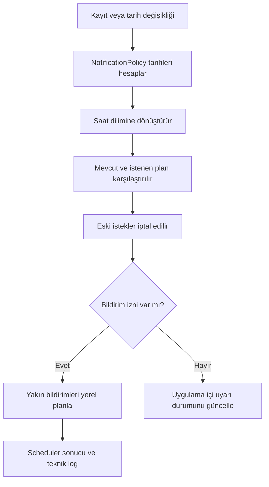

---

## 7. Güvenlik ve gizlilik

- Yerel SQLite veritabanı, Drift’in `sqlite3` hook’u üzerinden SQLite3MultipleCiphers ile korunur. Cipher varlığı açılışta doğrulanır.
- İlk çalıştırmada 256 bit rastgele veritabanı anahtarı üretilir; anahtar uygulama dosyalarına yazılmaz ve Android Keystore destekli AES-GCM/RSA-OAEP güvenli depoda tutulur.
- Android otomatik yedekleme kapalıdır. Keystore anahtarı kaybolduğunda mevcut şifreli veritabanı sessizce sıfırlanmaz veya yeni anahtarla açılmaya çalışılmaz.
- Veritabanı anahtarı Android aşamasında Keystore, iOS aşamasında Keychain adapter’ı üzerinden güvenli depoda tutulur.
- Taşınabilir export dosyası cihaz veritabanı anahtarıyla şifrelenmez. Kullanıcı parolası veya kurtarma sırrından türetilen platformdan bağımsız anahtar kullanır.
- Export paketi format sürümü, şema sürümü, salt, nonce/IV, KDF parametreleri, şifreli payload ve doğrulanmış bütünlük etiketi taşır.
- Taşınabilir export formatı Argon2id v1.3 (`m=64 MiB`, `t=3`, `p=4`, 16 bayt salt, 32 bayt çıktı) ve AES-256-GCM (12 bayt benzersiz nonce, 16 bayt tag) olarak ADR-0008’de kilitlenmiştir. Parametreler dosya header’ında sürümlenir; uzman incelemesi ve fiziksel cihaz benchmark’ı tamamlanmadan export yayın kriterini geçemez.
- Yanlış parola, bozuk bütünlük etiketi veya desteklenmeyen şema sürümünde hiçbir kayıt kısmen içe aktarılmaz.
- Export parolası veya kurtarma sırrı kaybolursa paketin kurtarılamayacağı kullanıcıya oluşturma sırasında açıkça bildirilir.
- Android’de oluşturulan export paketinin iOS aşamasında aynı sözleşmeyle açılabilmesi zorunludur.
- Kart numarası, CVV, IBAN, banka parolası ve ödeme kimlik bilgileri veri modeline alınmaz.
- Loglarda abonelik adı, tutar, not, e-posta ve ödeme yöntemi bulunmaz.
- Analytics olayları yalnızca açık tercih sonrası gönderilir; ad, tutar ve servis adı olay parametresi olmaz.
- Repository ve servisler en az yetki prensibiyle çalışır.
- Secret değerler repository’ye yazılmaz; environment/flavor ve CI secret sistemi kullanılır.
- Yedek geri yüklemeden önce bütünlük, şema sürümü ve checksum doğrulanır.
- Geri yükleme sessiz birleştirme yapmaz: önce mevcut yerel veri güvenli geçici yedeğe alınır, sonra kullanıcı onayıyla tam değiştirme uygulanır.
- Uygulama kullanıcı parolasını kendi veritabanında saklamaz; parola loglanmaz, analytics’e gönderilmez ve form işlemi tamamlandıktan sonra state’te tutulmaz.
- Auth sağlayıcısından yalnız gerekli profil alanları istenir; görünen ad zorunlu değildir.
- Pazarlama izni, işlevsel ödeme hatırlatmaları ve hesap güvenliği bildirimleri ayrı tercihlerdir.
- Hesap silme akışı auth kimliklerini, bulut yedeğini, kullanıcı metadata’sını ve ilgili kişisel verileri kapsar; alt adımlardan biri başarısızsa yanıltıcı başarı gösterilmez.
- Supabase ve federated identity sağlayıcılarının veri konumu, alt işleyenleri ve KVKK bakımından yurt dışı aktarım şartları hukuk danışmanıyla değerlendirilir.
- Hesap eklenirse uygulama içinden hesap silme zorunludur. Apple bunu hesap oluşturan uygulamalar için açıkça ister; Google Play ayrıca uygulama içi yol ve web üzerinden silme talebi bağlantısı ister. [Apple hesap silme gereksinimi](https://developer.apple.com/support/offering-account-deletion-in-your-app/), [Google Play hesap silme gereksinimi](https://support.google.com/googleplay/android-developer/answer/13327111)
- Gizlilik politikası uygulama içinden ve mağaza sayfasından erişilebilir olur. [App Store Review Guidelines](https://developer.apple.com/app-store/review/guidelines/)
- KVKK açısından veri envanteri, işleme amacı, saklama süresi ve imha davranışı hukuk danışmanıyla doğrulanır. İşleme sebebi ortadan kalktığında verinin silinmesi/yok edilmesi yükümlülüğü tasarıma yansıtılır. [KVKK silme ve imha rehberi](https://www.kvkk.gov.tr/Icerik/2038/kisisel-verilerin-silinmesi-yok-edilmesi-veya-anonim-hale-getirilmesi)
- Hatırlatma ve pazarlama bildirimleri gelecekte birbirinden ayrı tercihler olur; MVP yalnızca kullanıcının kurduğu işlevsel yerel hatırlatmaları gönderir. [KVKK mobil bildirim duyurusu](https://www.kvkk.gov.tr/Icerik/8578/mobil-uygulamalar-uzerinden-gonderilen-anlik-bildirimlere-iliskin-kamuoyu-duyurusu)

Bu bölüm hukuki görüş yerine geçmez; mağaza gönderiminden önce Türkiye’de yetkin hukuk danışmanı incelemesi yayın kriteridir.

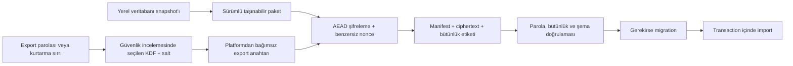

---

## 8. Mobil teknoloji karşılaştırması

| Kriter | Flutter + Riverpod | React Native + TypeScript | Kotlin + Swift |
|---|---|---|---|
| Tek kod tabanı | Çok güçlü | Güçlü; native ayrışmalar olabilir | Yok |
| Tip sistemi | Dart null safety, öngörülebilir | TS güçlü; çalışma zamanı JS | En güçlü platform tipleri |
| UI tutarlılığı | Çok yüksek | Native bileşen/paket farklılıkları | Platforma en doğal |
| Feature-based mimari | Çok uygun | Çok uygun | İki ayrı mimari gerekir |
| State yönetimi | Riverpod ile net | Zustand/Redux/TanStack seçimi parçalanabilir | Platform başına ayrı çözüm |
| Test edilebilirlik | Unit/widget/integration güçlü | JS testleri kolay, native/E2E daha parçalı | Güçlü fakat iki kat test |
| Paralel ekip | Modül sahipliği kolay | Modül sahipliği kolay | Üç kişide platform siloları oluşur |
| AI ajan okunabilirliği | Tek dil, katı lint ve düzenli yapı | Yaygın örnek çok; ekosistem çeşitliliği tutarsızlık riski yaratır | İki repo bağlamı ve iki dil |
| Aşamalı teslim ve bakım riski | En düşük | Orta | Yüksek; iki ayrı kod tabanı ve platform ekibi gerekir |
| Ekip başlangıç avantajı | Mevcut başlangıç deneyimi var | Belirgin React avantajı yok | Yok |
| Uzun dönem bakım | Tek kod tabanı; eklenti riski | Paket/native köprü riski | En pahalı fakat platform kontrolü yüksek |

### Karar

Flutter + Dart + Riverpod seçilecek.

Gerekçe:

- Ekibin sınırlı da olsa Flutter başlangıç avantajı var.
- Tek dil ve kod tabanı üç kişinin feature bazında çalışmasını kolaylaştırır.
- Riverpod bağımlılıkları ve feature state’ini açık tutar.
- Flutter’ın resmi mimari rehberi UI, repository, service ve ihtiyaç oldukça domain/use-case katmanını önerir; bu, istenen “aşırı clean architecture” riskini azaltan yapıyla uyumludur. [Flutter mimari rehberi](https://docs.flutter.dev/app-architecture/guide)
- React Native ikinci tercih olur; ancak ekipte güçlü React/TypeScript deneyimi olmadığı için ekosistem seçimi ve native köprü farkları ek risk getirir.
- Ayrı Kotlin/Swift uygulamaları üç kişilik ekipte iki kod tabanının mimari, test ve bakım yükünü gereksiz artırır.
- İlk aktif geliştirme ve ilk mağaza yayını Android odaklıdır. Flutter domain, repository sözleşmeleri ve feature presentation yapısı iOS uyarlamasında yeniden yazılmayacak şekilde platformdan bağımsız kalır.
- Android’e özgü bildirim, secure storage ve kimlik SDK kodları yalnız integration/adapter katmanında bulunur.
- iOS; Android çekirdeği kalite kapılarını geçtikten sonra ayrı bir aşamada IOSNotificationAdapter, IOSKeychainAdapter ve AppleAuthAdapter eklenerek uyarlanır.

### Sürüm ve paket politikası

- Flutter `3.44.8` ve Dart `3.12.2` Aşama 1 araç zincirinde sabitlenmiştir.
- Kilit dosyası commit edilir.
- Paket güncellemeleri ayrı PR ile yapılır.
- Riverpod provider’ları MVP’de manuel tanımlanır; gereksiz generator kullanılmaz.
- Drift’in zorunlu codegen çıktıları tutarlı komut ve CI kontrolüyle yönetilir.
- Android minimum SDK 23 olarak kilitlenmiştir; Keystore güvenli depolama ve kullanılan bildirim/şifreleme paketleri bu tabanı destekler.
- Android target SDK, Google Play yayın aşamasında güncel zorunlulukla yeniden doğrulanır. [Google Play target API şartı](https://developer.android.com/google/play/requirements/target-sdk)
- iOS minimum sürümü, Mac/Xcode ortamı ve güncel App Store SDK şartı iOS uyarlama aşamasının girişinde doğrulanır. [Apple geliştirici duyuruları](https://developer.apple.com/news/)

---

## 9. Backend karşılaştırması ve karar

| Seçenek | MVP uyumu | Değerlendirme |
|---|---|---|
| Tamamen yerel | En yüksek | Hesapsız kullanım, çevrimdışı güvenilirlik ve çekirdek ürünün bağımsızlığı için temel çözüm |
| Firebase | Orta | Auth ve otomatik offline sync güçlüdür; Firestore çoklu cihazda last-write-wins davranır ve istemeden tam sync kapsamına yaklaşır. [Firestore offline davranışı](https://firebase.google.com/docs/firestore/manage-data/enable-offline) |
| Supabase | Hesap ve bulut aşamalarına uygun | Auth, Postgres, RLS ve Storage avantajı; local-first sync hazır gelmez ve domain adapter arkasında tutulmalıdır |
| Özel backend | Çekirdek için düşük | Auth, yedek, operasyon ve silme sorumluluğunu artırır; banka entegrasyonu veya sunucu iş kuralları doğrulanmadan gerekmez |

### Karar

- Temel MVP backend gerektirmez.
- Yerel ana kaynak: Drift + şifreli SQLite.
- Hesap ve bulut özellikleri çekirdek Android ürününden bağımsız kalite aşamalarıdır; takvim yetişirse yapılan işler değildir.
- Auth ve snapshot yedekleme için varsayılan sağlayıcı Supabase’tir; domain ve ekranlar Supabase SDK’sına bağımlı değildir.
- `SupabaseAuthAdapter`, `AuthRepository` sözleşmesini; `SupabaseSnapshotBackupAdapter`, `CloudBackupRepository` sözleşmesini uygular.
- Bulut yedeği bir senkronizasyon tablosu değil, istemci tarafında şifrelenmiş tek geçerli snapshot olacaktır.
- Supabase Edge Function yalnız istemcinin güvenle yapamayacağı hesap silme ve yetkili metadata işlemlerinde kullanılır.
- Firebase yalnızca analytics/crash reporting seçilirse ürün veritabanından bağımsız entegrasyon olabilir.
- Özel backend ancak banka entegrasyonu, sunucu tarafı iş kuralları veya gerçek senkronizasyon gereksinimi doğunca değerlendirilir.

### Hesap ve bulut aşamalarının giriş kapıları

Hesap aşaması; çekirdek local-first akış, yerel migration testleri, auth sözleşmesi, KVKK veri akışı ve hesap silme tasarımı onaylandıktan sonra başlar. Bulut yedekleme aşaması ise hesap contract testleri, taşınabilir export ADR’si ve istemci taraflı şifreleme güvenlik incelemesi tamamlandıktan sonra başlar. Bu aşamalar yayın takvimine göre otomatik olarak eklenmez veya çıkarılmaz.

---

## 10. Çevrimdışı çalışma, yedek ve gelecekte senkronizasyon

- Tüm çekirdek özellikler uçak modunda çalışır.
- Repository’nin yazma/okuma kaynağı Drift’tir.
- Ağ durumunun ekran davranışına etkisi yalnızca hesap ve bulut modüllerinde görülür.
- Misafir kimliği rastgele UUID’dir; kişisel kullanıcı hesabı olarak sunulmaz.
- Hesap açılırsa mevcut UUID’ler korunur; yerel sahiplik idempotent transaction ile `AppUser.id` değerine bağlanır ve bulut yükleme ayrıca kullanıcı onayı bekler.
- Geri yükleme mevcut yerel veriyi sessizce birleştirmez; kullanıcıya kaynak, tarih, platform ve kayıt sayısı gösterilerek tam değiştirme ister.
- İki cihaz aynı hesabı kullanırsa son manuel yedek buluttaki tek snapshot’ı değiştirir; uygulama eski/yeni tarihleri gösterip üzerine yazma uyarısı verir.
- Tam senkronizasyona geçiş koşulları:
  - Kullanıcı görüşmelerinde çoklu cihaz ihtiyacının belirginleşmesi.
  - Hesap açanların en az %30’unun yedek kullanması.
  - Geri yükleme veya cihaz değiştirme talebinin destek taleplerinde düzenli görülmesi.
  - Çakışma çözümü için ayrı teknik çalışma kapasitesi bulunması.

---

## 11. Mimari yapı

### Üst seviye klasör yapısı

```text
lib/
├── app/
│   ├── bootstrap/
│   ├── navigation/
│   ├── localization/
│   └── theme/
├── core/
│   ├── domain/
│   ├── errors/
│   ├── logging/
│   ├── persistence/
│   ├── security/
│   └── utilities/
├── shared/
│   ├── widgets/
│   ├── forms/
│   ├── feedback/
│   └── accessibility/
├── features/
│   ├── onboarding/
│   ├── dashboard/
│   ├── recurring_payments/
│   ├── payment_methods/
│   ├── payment_occurrences/
│   ├── upcoming_payments/
│   ├── reports/
│   ├── settings/
│   ├── auth/
│   └── backup/
└── integrations/
    ├── notifications/
    │   ├── android/
    │   └── ios/
    ├── secure_storage/
    │   ├── android_keystore/
    │   └── ios_keychain/
    ├── authentication/
    │   ├── supabase/
    │   ├── google/
    │   └── apple/
    ├── analytics/
    ├── crash_reporting/
    └── cloud_backup/
```

Bu ağaç hedef mimariyi gösterir; `auth`, `backup` ve iOS adapter klasörleri ilgili aşama başlamadan boş olarak oluşturulmaz. Repository yalnız aktif aşamanın gerçek kod ve test ihtiyacını taşıyan dizinleri içerir.

Her feature yalnızca ihtiyaç duyduğu katmanları taşır:

```text
feature/
├── presentation/
│   ├── screens/
│   ├── widgets/
│   └── state/
├── domain/
│   ├── entities/
│   ├── repositories/
│   └── use_cases/
└── data/
    ├── datasources/
    ├── models/
    ├── mappers/
    └── repositories/
```

### Katman sorumlulukları

- `presentation`: widget, ekran, kullanıcı olayı, görünüm state’i, hata metni eşleme ve navigasyon çağrıları.
- `domain`: Flutter/Firebase/SQLite bağımlılığı olmayan entity, value object, iş kuralı, repository sözleşmesi ve anlamlı use-case.
- `data`: Drift tabloları, DTO, mapper, repository implementasyonu ve transaction.
- `app`: bootstrap, DI composition root, router, tema ve localization kurulumu.
- `core`: UI’dan bağımsız, bütün uygulamayı taşıyan hata, tarih/para primitive’i, loglama, güvenlik ve persistence temelleri.
- `shared`: birden fazla feature tarafından kullanılan görsel bileşenler ve form davranışları.
- `integrations`: platform veya sağlayıcı SDK implementasyonları.
- Android veya iOS’a özgü kod, ilgili integration/adapter klasörü dışına çıkamaz.

### Dosya ayırma kriterleri

Yeni dosya açılır:

- Ayrı sorumluluk veya bağımsız test birimi varsa.
- Widget yaklaşık 80–120 satırı aşar ya da başka yerde kullanılırsa.
- Ekran yaklaşık 250–300 satıra yaklaşırsa.
- Sınıfın birden fazla değişme nedeni varsa.
- Platform/sağlayıcı bağımlılığı soyutlanıyorsa.

Yeni dosya açılmaz:

- Yalnızca tek kısa metin, basit sabit veya bir kez kullanılan küçük private widget için.
- İş kuralı içermeyen birkaç satırlık yardımcı için.
- Henüz ikinci implementasyonu veya test ihtiyacı bulunmayan anlamsız wrapper için.

### Bağımlılık kuralları

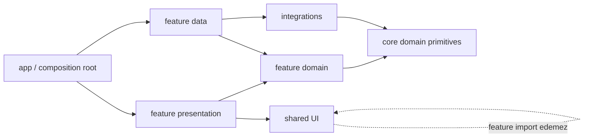

- Domain yalnızca Dart ve `core/domain` primitive’lerine bağlıdır.
- Presentation doğrudan Drift, Supabase veya bildirim plugin’i çağırmaz.
- Bir feature başka feature’ın `presentation` veya `data` klasörünü import etmez.
- Bir feature başka feature’ın somut repository implementasyonunu kullanamaz.
- Feature’lar arası iletişim domain sözleşmeleri veya app seviyesindeki orchestration ile yapılır.
- Harici SDK’lar ekranlardan ve domain katmanından çağrılamaz.
- Sağlayıcı kimlikleri domain varlıklarının ana kimliği olamaz.
- Yeni entegrasyonlar mevcut domain sözleşmelerinin adapter implementasyonu olarak eklenir.
- Kritik sözleşme değişiklikleri ADR, geriye uyumluluk/migration planı ve contract test gerektirir.
- Her kritik repository ve entegrasyon sözleşmesinin fake veya in-memory implementasyonu bulunur.
- Adapter değiştirme mimari testleri, ilgisiz feature kodunda değişiklik gerekmemesini doğrular.
- `core` ve `shared`, feature import edemez.
- Provider/DI tanımları feature içinde; composition root yalnızca bağlar.
- Dairesel bağımlılık CI’da dependency-rule testiyle engellenir.

### Soyutlamaların oluşturulma aşamaları

İlk çekirdek aşamalarda gerçek implementasyonu gerekenler:

- `RecurringPaymentRepository`
- `PaymentMethodRepository`
- `PaymentOccurrenceRepository`
- `NotificationPolicy`
- `AndroidNotificationScheduler`
- `LocalStorageService`
- `SecureStorageService`
- `ExportImportService`

Hesap aşamasında oluşturulanlar:

- `AuthRepository`
- `SupabaseAuthAdapter`
- `GoogleAuthAdapter`
- `AccountRepository`
- `IdentityLinkingService`
- `FakeAuthAdapter`

iOS aşamasında oluşturulanlar:

- `IOSNotificationAdapter`
- `IOSKeychainAdapter`
- `AppleAuthAdapter`

Bulut yedekleme aşamasında oluşturulanlar:

- `CloudBackupRepository`
- `SupabaseSnapshotBackupAdapter`
- `BackupEncryptionService`
- `FakeBackupAdapter`

Gerçek ihtiyaç oluşmadan oluşturulmayacaklar:

- `SyncEngine`
- `ConflictResolver`
- `BankingService`
- `CurrencyRateProvider`
- `RecurringPriceRepository`
- Premium/IAP adapter’ları

Bir arayüz yalnız “ileride gerekebilir” gerekçesiyle oluşturulmaz. İlk gerçek adapter, bağımsız test ihtiyacı veya yüksek değişim olasılığı bulunan platform/sağlayıcı sınırı ortaya çıktığında oluşturulur.

Çekirdek aşamada para birimi dönüşüm servisi veya stratejisi bulunmaz. Dashboard ve raporlar tutarları yalnız ISO 4217 `currencyCode` değerine göre gruplar; farklı para birimleri birleştirilmez. Gerçek kur dönüşümü ihtiyacı kullanıcı araştırması ve ürün metrikleriyle doğrulanırsa `CurrencyRateProvider` veya daha kapsamlı dönüşüm sözleşmesi seçenekleri ayrı ADR’de değerlendirilir.

### Kimlik doğrulama mimarisi

```text
Domain
- AppUser
- AuthIdentity
- AuthSession
- AuthFailure
- AuthRepository

Application/use cases
- ContinueAsGuest
- RegisterWithEmail
- SignInWithEmail
- SignInWithGoogle
- SignInWithApple
- LinkAuthIdentity
- ConvertGuestToAccount
- SignOut
- RequestPasswordReset
- DeleteAccount

Infrastructure
- SupabaseAuthAdapter
- GoogleIdentityAdapter
- AppleIdentityAdapter
- SecureSessionStorage
```

`AuthRepository` sağlayıcıdan bağımsız olarak `currentSession`, `continueAsGuest`, `registerWithEmail`, `signInWithEmail`, `signInWithGoogle`, `signInWithApple`, `linkIdentity`, `refreshSession`, `signOut` ve `deleteAccount` davranışlarını tanımlar. Provider SDK hata kodları repository sınırında `AuthFailure` türlerine eşlenir.

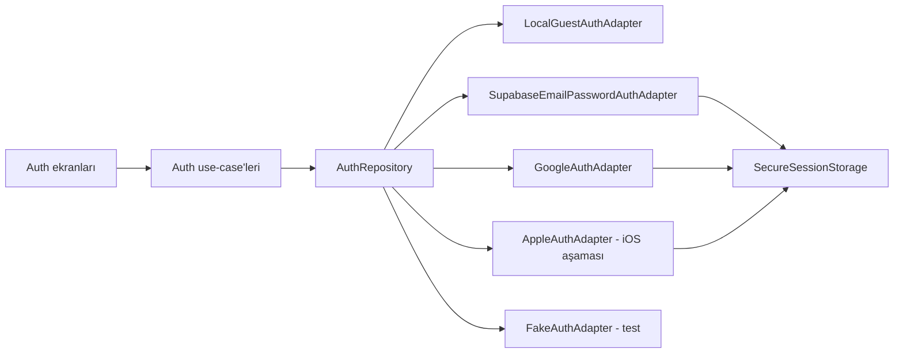

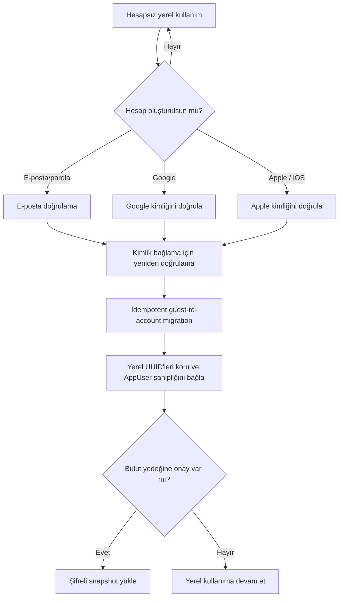

Identity linking yalnız doğrulanmış provider oturumu ve mevcut hesabın yeniden doğrulanmasıyla yapılır. Sağlayıcının döndürdüğü e-posta tek başına hesap birleştirme kanıtı değildir; Apple relay e-postası ayrı kimlik olarak ele alınabilir. Olası hesap birleşimi kullanıcı onayı, iki hesabın güvenli doğrulanması ve denetlenebilir sonuç gerektirir.

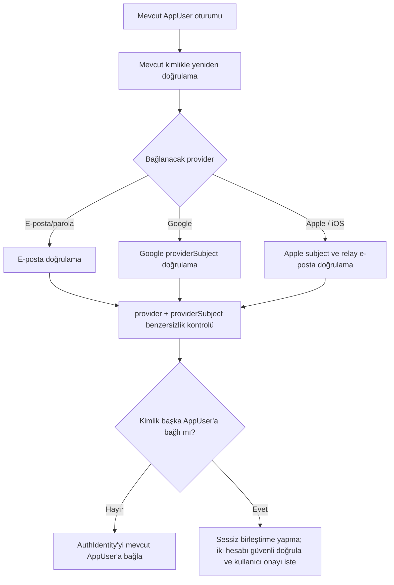

### Abonelik ekleme veri akışı

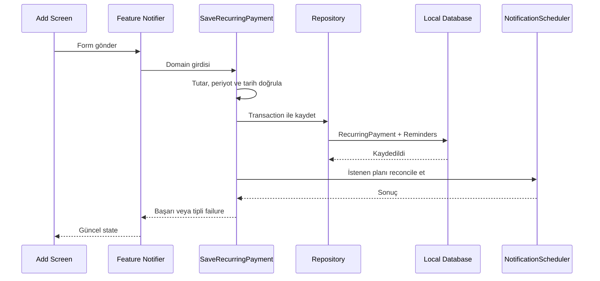

---

## 12. State management ve hata modeli

### Riverpod kullanımı

- Ekrana özel kısa ömürlü UI state: widget state veya feature-local provider.
- Feature iş akışı state’i: `Notifier`/`AsyncNotifier`.
- Veritabanı stream’leri: repository provider üzerinden feature state’ine bağlanır.
- Form input değerleri presentation’da; teknoloji bağımsız doğrulama domain’de.
- Auth state’i `features/auth` içinde guest, authenticated, expired ve signedOut durumlarını taşıyan ayrı bir state modelidir; çekirdek feature state’leri auth’a bağımlı değildir.
- Bildirim tercihleri settings feature’ının repository-backed state’idir.
- Tek global “AppState” dosyası oluşturulmaz.
- Sunucu state’i çekirdek üründe yoktur; hesap ve bulut işlemleri birbirinden ayrı finite-state modelleridir.
- Riverpod generator MVP’de kullanılmaz; generator ancak ölçülen boilerplate sorunu oluşursa ADR ile değerlendirilir.

### Hata modeli

Domain sonucu tipli failure taşır:

- `ValidationFailure`
- `DatabaseFailure`
- `NotificationFailure`
- `PermissionFailure`
- `ImportExportFailure`
- `AuthenticationFailure` — hesap aşaması
- `IdentityLinkingFailure` — hesap aşaması
- `GuestMigrationFailure` — hesap aşaması
- `NetworkFailure` — hesap/bulut aşaması
- `BackupFailure` — bulut aşaması
- `UnexpectedFailure`

Teknik hata kodu ile kullanıcı mesajı ayrılır. Presentation, failure kodunu localization anahtarına dönüştürür. Beklenmeyen exception’lar sınırda yakalanır, PII temizlenerek crash sistemine aktarılır.

---

## 13. Tasarım sistemi ve yerelleştirme

- Renk, tipografi, spacing, radius, elevation ve motion token’ları.
- Primary/secondary/text/destructive/tonal button çeşitleri.
- Ortak text field, money field, date picker, currency selector, card, dialog ve bottom sheet.
- Loading, empty, error, offline ve success durumları.
- Açık/koyu tema.
- WCAG’e uygun kontrast hedefi, en az 44×44 dokunma alanı.
- Dinamik yazı boyutu ve ekran okuyucu etiketleri.
- Sabit piksel genişliğine bağımlı olmayan responsive yerleşim.
- Bütün görünür metinler ARB yerelleştirme dosyalarından gelir.
- Anahtarlar anlamlı ve dilden bağımsızdır: `subscription.add.title`.
- İlk sürümde yalnız `tr` eksiksizdir; `en` aktif edilmez.
- Testlerde uzun sahte çeviri, farklı sayı/para biçimi ve gelecekte RTL’yi engelleyen düzenler kontrol edilir.
- Türkiye’ye özgü sağlayıcı önerileri config/catalog verisidir; çekirdek enum değildir.

---

## 14. Sistem bağlamı

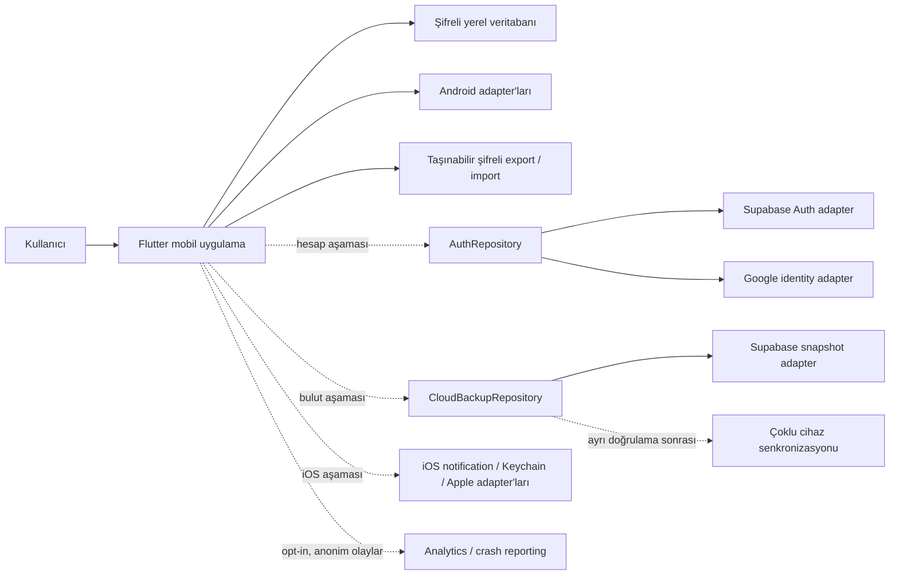

---

## 15. Üç kişilik ekip modeli

| Kişi | Birincil sahiplik | İkincil/review |
|---|---|---|
| Kişi 1 — Platform/Veri | App bootstrap, Drift, şifreleme, repository implementasyonları, CI; hesap aşamasında Supabase adapter’ları | Güvenlik ve migration review |
| Kişi 2 — Ürün/Arayüz | Tasarım sistemi, onboarding, dashboard, formlar, navigasyon, localization, mağaza materyalleri | Erişilebilirlik ve widget testleri |
| Kişi 3 — Domain/Kalite | Periyot ve tarih motoru, tahminler, PaymentOccurrence, bildirim policy, raporlar, test altyapısı | İş kuralı ve release QA |

Ortak sözleşmeler domain sahibi ve en az bir diğer geliştirici onayı olmadan değişmez. Shared/core dosyalarında CODEOWNERS benzeri çift review uygulanır.

Ekip sabit haftalara göre değil aktif kalite aşamasına göre çalışır. Bir aşama sahibi çıktıları koordine eder; sözleşme, güvenlik, schema veya platform adapter değişiklikleri en az iki kişinin incelemesini gerektirir. Android yayınından sonra iOS uyarlaması ayrı backlog ve kabul kapısıyla yürütülür.

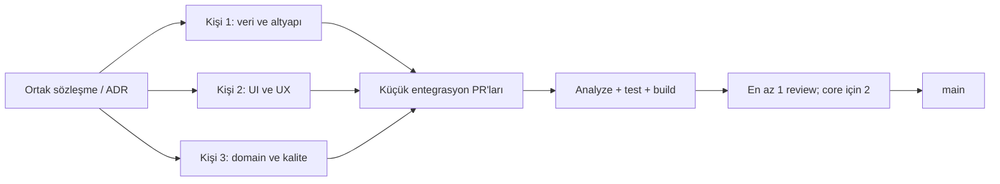

### Git modeli

- Trunk-based, kısa ömürlü branch’ler.
- Branch: `feature/...`, `fix/...`, `chore/...`, `docs/...`, `spike/...`.
- Conventional Commits: `feat:`, `fix:`, `test:`, `docs:`, `refactor:`, `chore:`.
- PR ideal olarak 400 satırın altında; büyük özellik sözleşme, veri ve UI PR’larına bölünür.
- `main` korumalıdır; doğrudan push yapılmaz.
- Merge için:
  - `flutter analyze`
  - Unit/widget testleri
  - Dependency rule kontrolü
  - Migration doğrulaması
  - Secret taraması
  - Android debug build
  - Etkilenen belgeler kontrolü
  - En az bir review; core/schema/security için iki review

PR sırası: ADR/sözleşme → domain testleri → data implementasyonu → presentation → entegrasyon/E2E.

---

## 16. Test stratejisi

### Test katmanları

- Domain unit:
  - Aylık/yıllık/özel periyot hesapları
  - 29–31 ve Şubat kuralları
  - Saat dilimi ve DST
  - Para birimi gruplama
  - Status geçişleri
- Repository:
  - CRUD ve transaction
  - Arşivleme
  - Benzersiz occurrence
  - Migration
  - Şifreli DB yeniden açma
- Mapper:
  - DB model/domain dönüşümü
  - Bilinmeyen enum ve eski şema
- State:
  - Loading/success/error
  - Form gönderme
  - Repository stream güncellemesi
- Widget/golden:
  - Türkçe normal/uzun metin
  - Açık/koyu tema
  - Büyük font
  - Empty/error/offline
- Notification:
  - Planlama, iptal, yeniden planlama
  - İzin reddi
  - Saat dilimi değişimi
  - Pending-limit önceliği
- Integration:
  - Ekle → dashboard → yaklaşan → ödendi
  - Düzenle → bildirim güncelle
  - İptal → geçmişi koru
  - Export → temiz kurulum → import
- Contract ve mimari sınır testleri:
  - `AuthRepository` contract’ının fake ve Supabase adapter’larında aynı davranışı vermesi
  - Guest → e-posta hesabı ve Guest → Google hesabı dönüşümü
  - Aynı guest migration işleminin tekrarında duplicate oluşmaması
  - Aynı `AppUser` hesabına ikinci provider bağlama ve yeniden doğrulama
  - Sağlayıcı e-postasına bakarak sessiz hesap birleştirilmemesi
  - Çıkışta yerel veriyi koruma ve yerel hesap verisini kaldırma seçenekleri
  - Hesap silmede auth, bulut snapshot ve metadata sonuçlarının ayrı doğrulanması
  - Auth sağlayıcısı hata eşleme ve süresi biten session yenileme
  - `AndroidNotificationScheduler` yerine fake adapter geçirildiğinde feature davranışının değişmemesi
  - Feature’ların başka feature’ın presentation/data veya somut repository implementasyonuna erişememesi
  - Supabase adapter değiştirildiğinde auth dışındaki feature kodunun değişmemesi
- Export/import güvenliği:
  - Yanlış parola ve bozuk bütünlük etiketi
  - Eski şema sürümünden kontrollü migration
  - Yarım importta transaction rollback
  - Büyük veri paketinde bellek ve süre sınırları
  - Android’de üretilen paketin iOS importer contract’ıyla açılabilmesi
- E2E:
  - Android geliştirme ve beta aşamalarında en az bir gerçek Android cihaz.
  - Android bildirim teslimi, izin ve deep link.
  - Uçak modu.
  - Uygulama kapalıyken davranış.
  - iPhone ve iOS E2E senaryoları yalnız iOS uyarlama aşamasının girişinden sonra zorunludur.

Test dizini kaynak yapısını yansıtır:

```text
test/
├── core/
├── shared/
├── features/
│   ├── recurring_payments/
│   ├── payment_records/
│   └── notifications/
└── integrations/
integration_test/
```

### Yayın kabul kriterleri

- P0/P1 hata yok.
- Crash-free test oturumları ≥ %99.
- Domain ve repository çekirdeklerinin anlamlı branch coverage’ı ≥ %80.
- Tarih/para motoru kritik kurallarında %100 senaryo kapsamı.
- Veri kaybı oluşturan migration/import hatası yok.
- Bildirim reddedildiğinde çekirdek kullanım çalışıyor.
- Türkçe UI’da kritik taşma ve erişilebilirlik engeli yok.
- Contract testleri ve dependency-rule testleri geçiyor.
- Guest-to-account dönüşümünde veri kaybı veya duplicate kayıt yok.
- Android yayınında iOS ortamı zorunlu değildir; iOS yayınında ortak domain ve repository testlerinin değiştirilmeden geçmesi zorunludur.

---

## 17. Kalite kapılı geliştirme yol haritası

Süre tahminleri yalnız kapasite planlaması için yardımcı bilgidir; aşama kapanışı veya mağaza yayını için sabit tarih taahhüdü oluşturmaz. Her aşama kabul kriterleri, testleri ve belge güncellemeleri tamamlanmadan kapanmaz.

### Aşama 0 kapanış kararı

- Aşama 0 ürün ve mimari kararları 3 Ağustos 2026 tarihinde onaylandı; yeni Aşama 0 ürün sorusu açılmadan Aşama 1 uygulanabilir.
- İlk genel Google Play sürümü local-first ve hesapsızdır; şifreli dosya export/import zorunlu, hesap ve bulut yedekleme sonraki bağımsız aşamadır.
- Google Play kalite adayında her kritik görevde en az `%80` başarı, ilk 24 saatte üç gerçek kayıtla en az `%60` aktivasyon, aktive kullanıcıların 14 günde iki farklı günde anlamlı eylem oranında en az `%40` ve görüşmelerde en az üçte iki belirgin fayda aranır.
- Kritik veri bütünlüğü, gizlilik/güvenlik hatası ve tekrarlanabilir ana akış çökmesi `0` olmalıdır.

### Aşama 0 — Ürün ve mimari kararlarını kilitleme

- **Amaç:** Ürün kapsamı, domain sınırları, Android-first stratejisi ve açık teknik kararları onaylamak.
- **Giriş kriterleri:** Ürün hedefi ve kullanıcı problemi ekipçe kabul edilmiş.
- **Çıktılar:** PRD, MVP kapsamı, veri modeli, navigasyon, dependency kuralları ve başlangıç ADR seti.
- **Değiştirilen modüller:** Kod modülü yok; yalnız onaylı belgeler.
- **Zorunlu testler:** Prototip görev testi ve mimari karar gözden geçirmesi.
- **Belge güncellemeleri:** Product, architecture, ADR, roadmap ve current-status belgeleri.
- **Çıkış kriterleri:** Açık karar sahipleri atanmış; çelişkili mimari karar kalmamış.
- **Bağımlılık:** Aşama 1 bu onaylara bağlıdır.
- **Ertelenebilir:** Kesin export algoritması güvenlik spike’ına; iOS ayrıntıları Aşama 12’ye kalabilir.

### Aşama 1 — Repository ve Android geliştirme altyapısı

- **Durum:** Kaynak, otomatik test ve Android debug build tamamlandı; fiziksel cihaz doğrulaması bekliyor.
- **Amaç:** Tekrarlanabilir Flutter/Android geliştirme, CI ve belge doğrulama ortamı kurmak.
- **Giriş kriterleri:** Aşama 0 tamamlanmış; Android SDK hazır. Gerçek Android cihaz erişimi çıkış doğrulamasından önce sağlanır.
- **Çıktılar:** Sürümleri sabit Flutter/Dart, lint, test, localization, router, Riverpod composition root, Drift repository altyapısı, deterministik tarih/clock, bildirim port/adapter sınırı, CI ve ilk dar dikey dilim.
- **Değiştirilen modüller:** `app`, `core`, temel `shared`, recurring-payments, dashboard, payment-occurrences ve notifications; hesap/bulut/iOS modülü yok.
- **Zorunlu testler:** Analyze, unit/widget, Android debug build, dependency-rule ve repository contract testleri; duplicate occurrence, paid/skipped ve yeniden açılış kalıcılık testleri.
- **Belge güncellemeleri:** Setup, testing, coding standards, git workflow ve current status.
- **Çıkış kriterleri:** Temiz checkout aynı komutlarla build ve test ediliyor; düzenli ödeme ekleme → dashboard → bildirim planlama → occurrence → paid/skipped → aylık özet akışı yerel kalıcılıkla çalışıyor.
- **Bağımlılık:** Domain geliştirmesi bu altyapıyı kullanır.
- **Ertelenebilir:** Mac/Xcode/iOS ortamı.

### Aşama 2 — Domain modeli ve tarih/periyot motoru

- **Amaç:** Teknolojiden bağımsız recurring-payment iş kurallarını tamamlamak.
- **Giriş kriterleri:** Aşama 1 test altyapısı çalışıyor.
- **Çıktılar:** Money, BillingCycle, recurrence, status geçişleri, tahmin ve gerçekleşen ayrımı.
- **Değiştirilen modüller:** `core/domain`, recurring-payments ve payment-records domain katmanları.
- **Zorunlu testler:** 29–31, Şubat, artık yıl, saat dilimi, özel periyot ve para birimi gruplama testleri.
- **Belge güncellemeleri:** Domain kuralları, database schema taslağı ve ilgili ADR’ler.
- **Çıkış kriterleri:** Kritik domain senaryoları tam ve platform bağımsız geçiyor.
- **Bağımlılık:** Yerel veri şeması onaylı domain’e dayanır.
- **Ertelenebilir:** Otomatik fiyat kaynağı ve kur dönüşümü; manuel geçerlilik tarihli fiyat sürümleri çekirdektedir.

### Aşama 3 — Yerel veri katmanı

- **Amaç:** Şifreli, migration destekli yerel ana veri kaynağını tamamlamak.
- **Giriş kriterleri:** Domain entity ve repository sözleşmeleri kararlı.
- **Çıktılar:** Drift/SQLite schema, mapper, repository implementasyonları ve Android Keystore adapter’ı.
- **Değiştirilen modüller:** Persistence, secure storage ve ilgili feature data katmanları.
- **Zorunlu testler:** CRUD, transaction, arşivleme, unique occurrence, migration, şifreli DB yeniden açma ve corruption davranışı.
- **Belge güncellemeleri:** Database schema, migration politikası ve güvenlik ADR’si.
- **Çıkış kriterleri:** Veri kaybı oluşturan açık hata yok; repository contract testleri geçiyor.
- **Bağımlılık:** UI yalnız repository sözleşmelerine bağlanır.
- **Ertelenebilir:** Auth ve uzak veri kaynağı.

### Aşama 4 — Temel Android kullanıcı arayüzü

- **Amaç:** Çekirdek işlevleri hesap gerektirmeden Android’de kullanılabilir hâle getirmek.
- **Giriş kriterleri:** Domain ve yerel repository’ler kararlı.
- **Çıktılar:** Onboarding, CRUD, ödeme yöntemleri, dashboard, yaklaşan ödemeler ve settings.
- **Değiştirilen modüller:** İlgili feature presentation/state ve design system.
- **Zorunlu testler:** Widget/golden, form validation, uçak modu, büyük font ve Türkçe taşma testleri.
- **Belge güncellemeleri:** Navigation map, user stories ve accessibility notları.
- **Çıkış kriterleri:** Ana görevler gerçek Android cihazda kritik kullanılabilirlik sorunu olmadan tamamlanıyor.
- **Bağımlılık:** Bildirim ve rapor akışları bu ekranlara bağlanır.
- **Ertelenebilir:** Hesap ekranları ve iOS görsel uyarlaması.

### Aşama 5 — Android bildirimleri

- **Amaç:** İnternetten bağımsız, kullanıcı kontrollü ödeme hatırlatmaları sunmak.
- **Giriş kriterleri:** Recurrence motoru ve Android detay ekranı çalışıyor.
- **Çıktılar:** NotificationPolicy, AndroidNotificationScheduler ve bildirim deep link’i.
- **Değiştirilen modüller:** Notifications feature/integration ve settings.
- **Zorunlu testler:** İzin reddi, exact-alarm fallback, yeniden başlatma, saat dilimi, iptal ve reconciliation.
- **Belge güncellemeleri:** Bildirim akışı, izin matrisi ve adapter contract’ı.
- **Çıkış kriterleri:** Gerçek Android cihaz testleri ve fake scheduler contract testleri geçiyor.
- **Bağımlılık:** PaymentOccurrence hızlı onay aksiyonu scheduler sözleşmesini kullanır.
- **Ertelenebilir:** Bildirimden doğrudan “Ödendi” ve iOS adapter’ı.

### Aşama 6 — PaymentOccurrence ve raporlar

- **Amaç:** Tahmini ve kullanıcı tarafından doğrulanmış giderleri açıkça ayırmak.
- **Giriş kriterleri:** RecurringPayment ve yerel veri akışları kararlı.
- **Çıktılar:** Ödendi/atlandı/düzeltildi akışları, para birimi bazlı tahmin ve gerçekleşen raporları.
- **Değiştirilen modüller:** Payment records, reports, dashboard ve notifications orchestration.
- **Zorunlu testler:** Idempotent occurrence, düzeltme/void, geçmişi koruma ve para birimi gruplama.
- **Belge güncellemeleri:** Reporting kuralları ve PaymentOccurrence şeması.
- **Çıkış kriterleri:** Tahmin ve gerçekleşen tutarlar hiçbir ekranda birbirine karışmıyor.
- **Bağımlılık:** Beta ve export kapsamı doğru veri setine dayanır.
- **Ertelenebilir:** Gelişmiş analiz ve uzun geçmiş girişi.

### Aşama 7 — Export/import ve güvenlik

- **Amaç:** Cihazlar arası taşınabilir, sürümlü ve şifreli veri paketi sağlamak.
- **Giriş kriterleri:** Yerel schema/migration kararlı; güvenlik spike kapsamı onaylı.
- **Çıktılar:** ExportImportService, portable paket formatı, parola/kurtarma UX’i ve rollback destekli import.
- **Değiştirilen modüller:** Core security, persistence ve settings/export UI.
- **Zorunlu testler:** Yanlış parola, bozuk bütünlük, schema migration, büyük veri, rollback ve platformlar arası contract.
- **Belge güncellemeleri:** Portable Encrypted Export ADR, tehdit modeli ve kurtarma açıklaması.
- **Çıkış kriterleri:** Güvenlik incelemesi onaylı; Android export’u platformdan bağımsız test vektörüyle açılabiliyor.
- **Bağımlılık:** Bulut snapshot şifrelemesi aynı format/sözleşmeden yararlanır.
- **Ertelenebilir:** Kesin iOS uygulaması Aşama 12’ye kadar fake importer ile doğrulanabilir.

### Aşama 8 — Android kapalı beta

- **Amaç:** Local-first çekirdeği gerçek hedef kullanıcılarla doğrulamak.
- **Giriş kriterleri:** Aşama 1–7 tamam; hesap ve bulut gerekmez.
- **Çıktılar:** Signed beta build, geri bildirim, görev/aktivasyon/geri dönüş ölçümü ve kalite adayı kararı.
- **Zorunlu testler:** Tam Android regresyon, migration, bildirim, export/import ve veri silme.
- **Çıkış kriterleri:** Birleşik ürün kapısı sağlanmış; P0/P1 ve kritik veri/gizlilik sorunu yok.

### Aşama 9 — İlk genel Android mağaza yayını

- **Amaç:** Kalite kapısını geçen local-first Android sürümünü kontrollü yayımlamak.
- **Giriş kriterleri:** Kapalı beta çıkış kriterleri, şifreli export/import güvenlik incelemesi, hukuk ve mağaza beyanları tamam.
- **Çıktılar:** Play listing, Data Safety, staged rollout, izleme ve rollback planı.
- **Zorunlu testler:** Release build, signing, install/upgrade, bildirim, migration ve export/import production smoke testleri.
- **Çıkış kriterleri:** Staged rollout kabul edilebilir; kritik üretim sorunu yok.
- **Ertelenebilir:** Hesap, bulut, iOS ve gerçek sync.

### Aşama 10 — Hesap ve kimlik doğrulama

- **Amaç:** Çekirdek kullanımı engellemeden isteğe bağlı hesap sunmak.
- **Giriş kriterleri:** İlk genel local-first sürüm kararlı; hesap/yedek ihtiyacı doğrulanmış; AuthRepository ve KVKK akışı onaylı.
- **Çıktılar:** E-posta/parola, Google girişi, provider-independent identity, idempotent guest migration, çıkış ve hesap silme.
- **Ertelenebilir:** Apple ile giriş ve gerçek sync.

### Aşama 11 — Şifreli bulut yedekleme

- **Amaç:** Kullanıcı onaylı uçtan uca şifreli snapshot yedekleme ve yeni cihaz kurtarması sunmak.
- **Giriş kriterleri:** Hesap aşaması kararlı; envelope-encryption ve güvenli birleştirme güvenlik incelemesi geçmiş.
- **Çıktılar:** BackupDataKey, parola/recovery/device wrapper’ları, Supabase adapter, sürümlü snapshot, önizlemeli birleştirme ve cloud delete.
- **Zorunlu testler:** RLS, yanlış parola, kurtarma, ağ kesintisi, conflict, duplicate, tombstone, rollback ve hesap silme koordinasyonu.
- **Çıkış kriterleri:** Bulut veya restore hatası yerel veriyi bozmuyor; sunucu snapshot’ı tek başına çözemiyor.

### Aşama 12 — iOS uyarlaması ve yayını

- **Amaç:** Ortak domain, repository sözleşmeleri ve feature yapısını yeniden yazmadan iOS desteği sağlamak.
- **Giriş kriterleri:** Android çekirdek kararlı; Mac/Xcode, Apple Developer hesabı ve iPhone test cihazı hazır.
- **Çıktılar:** iOS bildirim, Keychain, Apple auth adapter’ları; App Store metadata ve release.
- **Değiştirilen modüller:** Yalnız platform adapter’ları, iOS yapılandırması ve gerekli presentation uyarlamaları.
- **Zorunlu testler:** Ortak domain/repository testlerinin değişmeden geçmesi, iOS izin, Keychain, Apple relay e-posta, erişilebilirlik ve export import testleri.
- **Belge güncellemeleri:** iOS setup, platform matrisi, App Store privacy ve Apple auth ADR ekleri.
- **Çıkış kriterleri:** Android davranışı bozulmamış; App Store kabul ve iOS kalite eşikleri sağlanmış.
- **Bağımlılık:** Gerçek sync iki platformun aynı domain kimlik modelini kullanmasına dayanır.
- **Ertelenebilir:** iOS’a özgü ikincil görsel iyileştirmeler.

### Aşama 13 — Gerçek çoklu cihaz senkronizasyonu

- **Amaç:** Doğrulanmış ihtiyaç sonrası Android ve iOS arasında güvenilir çift yönlü sync sağlamak.
- **Giriş kriterleri:** Yedek kullanım metrikleri ve kullanıcı araştırması gerçek sync ihtiyacını doğrulamış.
- **Çıktılar:** Sync protokolü, conflict modeli, tombstone/version alanları ve gözlemlenebilirlik.
- **Değiştirilen modüller:** Ayrı sync orchestration ve remote data adapter’ları; mevcut domain sözleşmeleri yalnız onaylı migration ile değişebilir.
- **Zorunlu testler:** Çift cihaz, offline edit, clock skew, duplicate, delete conflict, retry ve veri kaybı senaryoları.
- **Belge güncellemeleri:** Sync ADR, conflict politikası, veri akışı ve operasyon runbook’u.
- **Çıkış kriterleri:** Contract, migration, yük ve kaos testleri geçmiş; geri dönüş planı hazır.
- **Bağımlılık:** Hesap, provider-independent kimlik ve bulut altyapısı kararlı olmalıdır.
- **Ertelenebilir:** Gerçek zamanlı güncelleme; önce güvenilir periyodik sync tercih edilebilir.

```mermaid
flowchart LR
    CORE["Platformdan bağımsız Flutter çekirdeği"] --> ANDROID["Android adapter'ları"]
    ANDROID --> BETA["Android kapalı beta"]
    BETA --> PLAY["Google Play yayını"]
    PLAY --> IOSGATE["iOS giriş kriterleri: Mac, Xcode, hesap, cihaz"]
    IOSGATE --> IOSADAPTERS["iOS notification, Keychain ve Apple auth adapter'ları"]
    IOSADAPTERS --> COMMON["Ortak domain ve repository contract testleri"]
    COMMON --> APPSTORE["App Store yayını"]
```

---

## 18. Mağaza yayın süreci

### Ortak hazırlık

- Ürün adı, bundle/application ID ve marka hakları.
- Gizlilik politikası ve destek sayfası.
- Veri saklama/silme açıklaması.
- Türkçe ekran görüntüleri, açıklama, anahtar kelimeler.
- Uygulama simgesi ve erişilebilir onboarding.
- Test hesabı yalnız hesap özelliği yayın kapsamındaysa.
- Analytics/crash/backup SDK’larının veri beyanları.
- Gerçek cihaz release build ve imza doğrulaması.

### Google Play

- İlk mağaza yayını Android içindir ve yalnız Aşama 8 kapalı beta kalite kriterleri sağlandıktan sonra Aşama 9’da başlar.
- Organizasyon geliştirici hesabı ve kişisel hesap paylaşmadan rol bazlı erişim.
- Play App Signing.
- Target API seviyesi yayın hazırlığında güncel Google Play zorunluluğuna göre doğrulanır.
- Data Safety, içerik derecelendirme, reklam beyanı ve hesap silme URL’si.
- Internal → closed testing → staged production.
- Bildirim dışında yüksek riskli izin talep edilmez.

### App Store

- iOS yayını Android ile eş zamanlı değildir; Aşama 12’de ayrı giriş ve çıkış kriterleriyle yürütülür.
- Apple Developer organizasyon hesabı ve App Store Connect rolleri.
- Privacy Nutrition Labels.
- Uygulama içi gizlilik politikası.
- Hesap açılıyorsa uygulama içinden hesap silme.
- TestFlight internal/external test.
- App Review notlarında local-first ve opsiyonel hesap davranışı açıklanır.
- Google hesabıyla giriş iOS’ta sunuluyorsa Apple ile giriş eşdeğer seçenek olarak sağlanır.
- Apple private email relay, identity-linking ve hesap kurtarma senaryolarında kalıcı gerçek e-posta kabul edilmez.

### Android’den iOS’a geçiş kontrol listesi

- Domain modeli ve `AppUser` kimliği değiştirilmeden kullanılıyor.
- Repository ve contract testleri iOS adapter’larıyla aynı davranışı doğruluyor.
- Feature presentation yapısı korunuyor; yalnız gerekli platform UX uyarlamaları yapılıyor.
- Android’e özgü SDK çağrısı integration/adapter dışına sızmamış.
- IOSNotificationAdapter ve IOSKeychainAdapter tamamlanmış.
- AppleAuthAdapter, relay e-posta ve hesap silme senaryoları tamamlanmış.
- Android export paketi iOS’ta başarıyla açılıyor.
- iOS izin, dinamik yazı boyutu, VoiceOver ve erişilebilirlik testleri geçiyor.
- App Store privacy beyanları ve güncel SDK şartları yeniden doğrulanmış.
- Android regresyon testleri iOS değişikliklerinden sonra yeniden geçiyor.

---

## 19. Gelir modeli

### İlk ürün doğrulama dönemi

- İlk ürün doğrulama dönemi boyunca tamamen ücretsiz.
- Reklam, limit, IAP ve ödeme duvarı yok.
- `EntitlementService`, `FreeEntitlementStrategy`, premium plan tipi veya mağaza SDK’sı kod seviyesinde oluşturulmaz.
- Premium/IAP için yalnız olası entegrasyon sınırları belgelenir; gerçek sözleşme ve adapter’lar ücretli özellik ihtiyacı doğrulandığında ayrı ADR ve aşamayla oluşturulur.
- Çekirdek ürün davranışı ödeme planı veya entitlement kontrolüne bağlanmaz.

### Freemium’a geçiş

Ürün doğrulandıktan sonra potansiyel premium alanlar:

- Bulut yedekleme ve çoklu cihaz.
- Gelişmiş raporlar.
- Fiyat geçmişi.
- Sınırsız geçmiş ve export biçimleri.
- Aile/ortak hesap.
- Akıllı analizler.

Ücretlendirme testi ancak şu koşullarda başlar:

- D30 tutundurma hedefe yaklaşmış.
- Aktif kullanıcı başına medyan en az 3 düzenli ödeme.
- Kullanıcıların önemli bölümü bildirim veya rapor özelliğini tekrar kullanıyor.
- En az 15 görüşmede çözülen problem ve ödemeye değer özellik doğrulanmış.
- Mağaza içi satın alma, restore purchase ve entitlement güvenliği için ayrı ADR hazırlanmış.

---

## 20. İlk kullanıcılarla fikir doğrulama

1. Türkiye’den hedef profile uygun 12–15 kişiyle problem görüşmesi.
2. Beş kullanıcıyla tıklanabilir prototip görevleri:
   - İlk ödeme ekleme
   - Hangi karttan ödendiğini bulma
   - Yaklaşan ödeme görme
   - Ödeme onaylama
   - Bildirim değiştirme
3. 20–30 kişilik dört haftalık kapalı beta.
4. Birinci ve üçüncü haftada kısa görüşme.
5. Uygulama içinde isteğe bağlı geri bildirim.
6. Davranış verisi ile söylenen ihtiyacı birlikte değerlendirme.
7. Özellik taleplerini tekil istekle değil tekrar sıklığı ve temel probleme etkisiyle önceliklendirme.
8. Fiyat artışı araştırmasında tek uygulamadan zam haberi ihtiyacı, yalnız kullanıcının eklediği hizmetler, eski-yeni karşılaştırması, otomatik uygulama yerine onay ve resmî fiyat/kullanıcının gerçek ödediği tutar ayrımı ayrıca sorulur.

### İlk başarı metrikleri

- Aktivasyon: ilk 24 saatte en az 3 gerçek düzenli ödeme ekleyip bir sonraki tarihi doğrulayan ve dashboard’u görenler; hedef en az `%60`.
- Devam eden kullanım: aktive kullanıcıların 14 gün içinde en az iki farklı günde anlamlı eylem yapması; hedef en az `%40`.
- Kayıt başına form tamamlama süresi ve terk oranı.
- D1, D7 ve D30 kullanıcı tutundurma.
- WAU/MAU.
- Kullanıcı başına aktif düzenli ödeme medyanı.
- Bildirim izin kabul oranı.
- Bildirimi etkin kayıt oranı.
- Bildirimden veya uygulamadan ödeme onaylama oranı.
- Aylık raporu görüntüleyen aktif kullanıcı oranı.
- Export kullanım oranı ve bulut aşaması yayımlandığında yedekleme kullanım oranı.
- Kullanıcı bildirimiyle bulunan veri kaybı sayısı: hedef sıfır.
- Crash-free session ve bildirim zamanlama başarısı.
- Nitel geri bildirimde “tek yerde görme” değerinin tekrar edilme oranı.
- Moderatör yardımsız kritik görev başarı oranı: her görevde en az `%80`.
- Görüşmelerde belirgin fayda ve kullanmaya devam etme isteği: en az üçte iki.

Analytics olaylarında abonelik adı, tutar, ödeme yöntemi ve not gönderilmez.

---

## 21. Dokümantasyon ve yapay zekâ uyumluluğu

### Kesin belge ağacı

```text
/
├── README.md
├── AGENTS.md
├── CONTRIBUTING.md
├── CHANGELOG.md
└── docs/
    ├── README.md
    ├── product/
    │   ├── product-vision.md
    │   ├── prd.md
    │   ├── mvp-scope.md
    │   └── user-stories.md
    ├── architecture/
    │   ├── architecture-overview.md
    │   ├── module-map.md
    │   ├── dependency-rules.md
    │   ├── data-flow.md
    │   ├── navigation-map.md
    │   └── database-schema.md
    ├── adr/
    │   ├── README.md
    │   ├── 0001-flutter.md
    │   ├── 0002-riverpod.md
    │   ├── 0003-local-first-drift.md
    │   ├── 0004-backup-strategy.md
    │   ├── 0005-market-and-localization.md
    │   ├── 0006-multi-currency.md
    │   ├── 0007-forecast-vs-payment-record.md
    │   ├── 0008-local-notifications.md
    │   ├── 0009-android-first-platform-strategy.md
    │   ├── 0010-guest-first-optional-account.md
    │   ├── 0011-email-password-and-federated-identities.md
    │   ├── 0012-provider-independent-app-user.md
    │   ├── 0013-guest-to-account-migration.md
    │   ├── 0014-portable-encrypted-export.md
    │   └── 0015-milestone-based-development.md
    ├── development/
    │   ├── setup.md
    │   ├── testing.md
    │   ├── coding-standards.md
    │   ├── git-workflow.md
    │   └── definition-of-done.md
    └── project/
        ├── roadmap.md
        ├── current-status.md
        ├── known-issues.md
        └── backlog.md
```

MVP öncesi zorunlu: README, AGENTS, PRD, MVP scope, user stories, architecture overview, module/dependency/navigation/database belgeleri, ADR’ler, setup/testing/coding standards/git workflow/DoD ve current status.

İleri aşamalar: ayrıntılı API sözleşme kataloğu, banka/e-posta entegrasyon rehberleri, operasyon runbook’u ve sync conflict dokümanı yalnız ilgili aşama başladığında hazırlanır.

### Belge sahipliği ve güncelleme matrisi

| Değişiklik | Güncellenecek belge | Sahip |
|---|---|---|
| Ürün davranışı/kapsam | PRD, MVP scope, user story | Kişi 2 |
| Yeni modül veya bağımlılık | Module map, dependency rules, ADR | Kişi 1 |
| Veri alanı/migration | Database schema, ilgili ADR | Kişi 1 + Kişi 3 review |
| İş kuralı | User story, domain testleri, gerekirse ADR | Kişi 3 |
| Yeni ekran/route | Navigation map | Kişi 2 |
| Komut/araç/paket | Setup, testing, README | Değişikliği yapan |
| Mimari karar değişikliği | Eski ADR `superseded`, yeni ADR | Karar sahibi |
| Gerçek aşama değişikliği | Current status | PR sahibi |

Her küçük refactor belge değişikliği gerektirmez. PR şablonu “Belge etkisi: yok / güncellendi / takip işi” alanı taşır.

### Kök `AGENTS.md` taslağı

```text
Amaç:
Sabit ve öngörülebilir düzenli ödemeleri local-first takip eden Flutter uygulaması.

Bir göreve başlamadan önce:
1. Bu dosyayı ve docs/project/current-status.md dosyasını oku.
2. İlgili feature, testler, sözleşmeler ve ADR’leri incele.
3. Mevcut yardımcıları ve repository’leri ara.
4. Değişiklik ve test kapsamını belirle.
5. Onaylanmış mimariyi sessizce değiştirme.

Zorunlu kurallar:
- Presentation doğrudan DB, SDK veya API çağırmaz.
- Domain Flutter ve sağlayıcı bağımlılığı taşımaz.
- Görünür metinler localization dosyalarından gelir.
- Para double olarak tutulmaz.
- Hassas kullanıcı verisi loglanmaz.
- Yeni bağımlılık gerekçesiz eklenmez.
- Test silerek hata çözülmez.
- Büyük mimari değişiklik ADR gerektirir.

Bitirmeden önce:
- Format, analyze ve ilgili testleri çalıştır.
- Etkilenen belge matrisini kontrol et.
- Veri modeli değiştiyse migration testi ekle.
- Proje aşaması gerçekten değiştiyse current-status.md güncelle.
```

Modül bazlı `AGENTS.md` yalnız recurrence/notifications, persistence/migrations ve backup/sync gibi kritik modüllerde oluşturulur.

### `current-status.md` taslağı

```text
Son güncelleme:
Mevcut aşama:
Son tamamlanan:
Şu anda üzerinde çalışılan:
Sıradaki görev:
Açık teknik kararlar:
Bilinen hatalar:
Blokerler:
Son doğrulama:
- flutter analyze:
- flutter test:
- integration tests:
- Android build:
- iOS build: yalnız iOS aşaması aktifse
- contract tests:
- dependency rules:
```

---

## 22. Architecture Decision Record özeti

Her ADR şu alanları içerir: durum, tarih, bağlam, seçenekler, karar, gerekçe, olumsuz sonuçlar ve yeniden değerlendirme koşulları.

| ADR | Karar | Başlıca olumsuz sonuç | Yeniden değerlendirme |
|---|---|---|---|
| 0001 | Flutter + Dart | Native plugin bağımlılığı | Kritik plugin/performans engeli |
| 0002 | Riverpod, manuel provider | Bir miktar boilerplate | Tekrarlayan provider kodu ölçülürse |
| 0003 | Local-first Drift/SQLite | Sync hazır gelmez | Çoklu cihaz doğrulanırsa |
| 0004 | Supabase, adapter arkasında auth ve şifreli snapshot sağlayıcısı | Gerçek sync sağlamaz; sağlayıcı operasyonu ve KVKK incelemesi gerekir | Veri konumu, maliyet veya sağlayıcı kısıtı değişirse |
| 0005 | Türkiye’de Türkçe doğrulama, global-ready i18n | İlk yabancı pazar gecikir | D30 ve kullanım hedefleri sağlanırsa |
| 0006 | Çoklu para birimi, dönüşüm yok | Tek genel toplam yok | Kullanıcıların kur talebi doğrulanırsa |
| 0007 | Tahmin sanal, gerçekleşen kayıt kullanıcı aksiyonuyla | Gerçek gider eksik kalabilir | Banka/import doğrulaması eklenirse |
| 0008 | Yerel bildirim, varsayılan 3 gün + ödeme günü | OS teslimat sınırlamaları | Push veya server scheduling ihtiyacı doğarsa |
| 0009 | Android-first geliştirme ve yayın; iOS ayrı uyarlama aşaması | iOS kullanıcıları daha geç erişir | Android çekirdeği kararlı olduğunda veya pazar verisi iOS’u öne çıkarırsa |
| 0010 | Hesapsız çekirdek kullanım ve isteğe bağlı hesap | Bazı kullanıcılar yedek avantajını geç keşfedebilir | Hesap gerektiren temel özellik ortaya çıkarsa |
| 0011 | Android’de e-posta/parola ve Google; iOS’ta Apple eşdeğer kimlik seçeneği | Provider yapılandırma ve hesap kurtarma karmaşıklığı | Sağlayıcı politikası veya kullanıcı talebi değişirse |
| 0012 | Sağlayıcıdan bağımsız UUID `AppUser` ve çoklu `AuthIdentity` | Identity-linking için ek tablo ve use-case gerekir | Tek sağlayıcıya kalıcı geçiş kararı alınırsa |
| 0013 | İdempotent, transaction destekli guest-to-account migration | Dönüşüm state’i ve retry yönetimi gerekir | Çekirdek kullanım hesap zorunlu hâle gelirse |
| 0014 | Cihaz anahtarından bağımsız taşınabilir şifreli export | Kullanıcı sırrı kaybında kurtarma mümkün olmayabilir | Güvenlik spike’ı, uzman incelemesi veya platform gereksinimi değişirse |
| 0015 | Sabit teslim tarihi yerine kalite kapılı aşamalar | Takvim tahmini daha az kesin görünür | Dış sözleşme zorunlu tarihi oluşsa bile kalite kapıları ayrıca korunur |
| 0016 | `PaymentOccurrence`: gelecek sanal, vade günü snapshot ile kalıcı, kullanıcı onayı olmadan `paid` yok | Onay bekleyen dönemler birikebilir | Banka/import doğrulaması eklenirse |
| 0017 | İş tarihleri `LocalDate`, bildirim saati `LocalTime`, audit zamanı UTC `Instant` | Saat dilimi/DST yeniden planlama testleri gerekir | Sağlayıcı kesin timestamp sağlarsa |
| 0018 | Geçerlilik tarihli fiyat sürümleri; ortak kayıtta toplam plan ve kullanıcı yükümlülüğü bağımsız | Şema ve form karmaşıklığı artar | Ortak kullanım ihtiyacı doğrulanmazsa UI sadeleştirilir |
| 0019 | İlk genel Play sürümü hesapsız local-first; şifreli dosya export/import zorunlu | Otomatik cihaz kurtarması yok | Hesap ve bulut ihtiyacı doğrulanınca |
| 0020 | Arşivleme varsayılan; kalıcı silmede 30 günlük geri alma ve tombstone | Fiziksel temizleme işi gerekir | Hukuk/saklama politikası farklı süre gerektirirse |
| 0021 | Uzak analitik varsayılan kapalı, ayrı opt-in ve tip güvenli allowlist | Ölçüm örneklemi küçülür | Hukuk ve kullanıcı araştırması farklı yaklaşımı doğrularsa |
| 0022 | İsteğe bağlı uygulama kilidi yalnız Android sistem kimlik doğrulamasıyla | Cihaz ekran kilidine bağımlıdır | Ayrı uygulama PIN’i ihtiyacı doğrulanırsa |

İngilizce sürüm için önerilen kapı:

- D30 tutundurma ≥ %20.
- Aktif kullanıcı başına medyan ≥ 3 kayıt.
- Bildirimli kayıt oranı ≥ %50.
- En az 100 aylık aktif kullanıcı veya yeterli nitel görüşme hacmi.
- Türkçe sürümde açık kritik kullanılabilirlik sorunu olmaması.
- Profesyonel İngilizce kontrolü ve uzun metin QA’sı.
- Hedef yabancı ülkenin ayrıca seçilip hukuk/mağaza analizinin yapılması.

---

## 23. Kodlama öncesi kritik sorular ve varsayılanlar

Kod başlamadan önce ekip tarafından sahip atanarak kesinleştirilecekler:

1. Ürün adı, Android application ID ve domain — kesin isim yoksa geçici çalışma adı kullanılır; mağaza kaydı açılmaz.
2. Google Play organizasyon hesabının sahibi ve ekip rolleri — kişisel hesap paylaşılmaz.
3. Gizlilik/KVKK hukuki incelemesini kimin yöneteceği; Supabase/Google veri konumu, alt işleyenleri ve yurt dışı aktarım şartları.
4. Android minimum SDK kararı — Aşama 1’de API 23 olarak kilitlendi; daha yüksek taban yalnız hedef kullanıcı cihaz verisi gerektirirse ayrı ADR ile değerlendirilir.
5. Fiziksel Android test cihazları ve kapalı beta grubunun hazır olup olmadığı.
6. Kategori/sağlayıcı başlangıç kataloğunun içeriği — katalog olmadan serbest giriş çalışır.
7. Analytics açık rıza metni ve sağlayıcısı — hukuk onayı yoksa analytics varsayılan kapalıdır.
8. Şifreli veritabanı spike sonucu — SQLite3MultipleCiphers paketleme ve debug build doğrulaması geçti; anahtar kaybı, reinstall ve migration davranışları fiziksel cihaz test kapısında tamamlanır.
9. Taşınabilir export kullanıcı yedek parolasıyla açılır; KDF/AEAD ve başlangıç parametreleri ADR-0008’de seçildi. Uygulama öncesinde fiziksel cihaz benchmark’ı, kütüphane güvenlik incelemesi ve platformlar arası test vector’ları tamamlanır. Bulut aşamasındaki kurtarma kodu ilk local export için zorunlu değildir.
10. Identity-linking ve hesap kurtarma UX’i — yanlış duplicate hesapta iki kimliğin nasıl yeniden doğrulanacağı ve birleşimin nasıl onaylanacağı.
11. Supabase Auth provider ayarları, e-posta gönderim altyapısı ve hesap silme Edge Function sorumlusu.
12. Tasarım yönü, isim ve görsel kimlik — Aşama 4 başlamadan kilitlenir.
13. Apple Developer hesabı, Mac/Xcode ortamı, iPhone cihazı ve iOS minimum sürümü — yalnız Aşama 12 girişinde zorunludur.

### Açık olmayan noktalarda seçilmiş varsayımlar

- İlk mağaza yayını Türkiye ve Türkçedir.
- Varsayılan locale `tr-TR`, para birimi TRY’dir.
- Veri modeli küresel locale ve çoklu para birimine hazırdır.
- Temel uygulama hesap ve internet olmadan çalışır.
- İlk geliştirme ve ilk mağaza yayını Android odaklıdır; iOS ayrı kalite aşamasıdır.
- Hesap ve bulut, kendi giriş ve çıkış kriterleri olan ayrı sonraki aşamalardır.
- Bulut yedekleme, çekirdek Android ürününün çalışması için zorunlu değildir.
- Raporlar tahmin ve onaylanmış gerçekleşeni ayrı sunar.
- Sabit/öngörülebilir ödemeler tek `RecurringPayment` modeli altında tutulur.
- İlk sürüm ücretsiz ve reklamsızdır.
- `AppUser` kimliği sağlayıcıdan bağımsız UUID’dir; e-posta/parola, Google ve ileride Apple kimlikleri aynı kullanıcıya güvenli biçimde bağlanabilir.

---

## 24. Mimari onay kontrol listesi ve ilk uygulama adımı

Plan onayı 3 Ağustos 2026 tarihinde verildi. Aşama 1 uygulanırken:

- Yeni ve temiz Flutter/Android uygulama temeli bu çalışma alanında oluşturulur.
- Supabase, auth, bulut backend’i, iOS, IAP ve otomatik fiyat entegrasyonu oluşturulmaz.
- İlk çalışan dikey dilim aylık ödeme, para birimi kodu, sonraki tarih, isteğe bağlı ödeme yöntemi, basit kategori, occurrence ve aylık özetle sınırlıdır.
- Drift, tarih/clock ve bildirim sınırları contract testlerle doğrulanır.

Onay kriterleri:

- MVP ve yapılmayacaklar kabul edildi.
- Flutter/Riverpod kararı kabul edildi.
- Local-first çekirdek, isteğe bağlı hesap ve ayrı bulut aşaması kabul edildi.
- Tahmin/gerçekleşen ayrımı kabul edildi.
- Veri modeli ve silme davranışı kabul edildi.
- Bildirim varsayılanları kabul edildi.
- Ekip sahipliği kabul edildi.
- Android-first stratejisi ve iOS’un ayrı uyarlama aşaması kabul edildi.
- Sabit takvim yerine kalite kapılı aşamaların giriş/çıkış kriterleri kabul edildi.
- Sağlayıcıdan bağımsız `AppUser`, `AuthIdentity`, `AuthSession` ve `AuthRepository` modeli kabul edildi.
- Guest-to-account migration’ın idempotency, transaction ve veri kaybı kuralları kabul edildi.
- Taşınabilir export için cihaz anahtarından bağımsız anahtar modeli ve güvenlik spike kapsamı kabul edildi.
- Modül contract testleri ve dependency sınırları kabul edildi.
- Gizlilik inceleme sahibi belirlendi.
- Ürün adı/bundle kimliği için karar süreci belirlendi.

Aşama 1’de temiz repository, zorunlu belgeler ve ADR’ler, sabit Flutter araç zinciri, Drift şifreleme ve Android bildirim sınırı oluşturuldu. İlk dar dikey dilim otomatik testleri ve Android debug build’i geçti. iOS ortamı ve iPhone bu aşamada zorunlu değildir. Aşama 1’in kalan kalite kapısı, fiziksel Android cihazda Keystore, şifreli yeniden açılış, bildirim zamanlaması ve uygulama yeniden başlatma davranışını doğrulamaktır.
