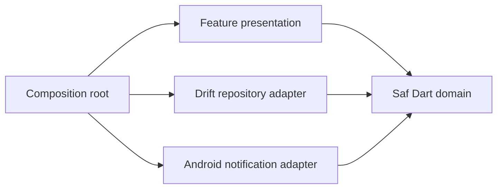

# Mimari görünüm

Uygulama Android-first ve local-first çalışır. Flutter UI ile platformdan bağımsız saf Dart domain kuralları birbirinden ayrılır. Drift yerel ana veri kaynağıdır; Android bildirimleri domain portunun adapter'ı olarak bağlanır.

İlk dikey dilim yalnız aylık düzenli ödeme, vade occurrence'ı, paid/skipped sonucu ve takvim ayı özetini kapsar.

